# Town Hall — Prefeitura

<!-- ficha-visual: bloco -->
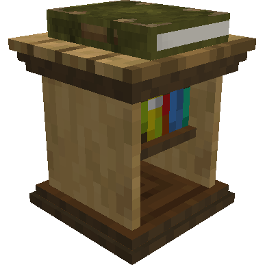

## Galeria — Medieval Dark Oak

| Vista frontal | Vista traseira |
|---|---|
| ![[assets/construcoes/medieval-dark-oak/fundamentals/townhall/front.jpg]] | ![[assets/construcoes/medieval-dark-oak/fundamentals/townhall/back.jpg]] |

> [!INFO] Variante disponível
> O acervo também contém `fundamentals/alttownhall`.

## Visão geral

A Prefeitura é o centro administrativo da colônia. Seu primeiro posicionamento define o centro permanente da proteção, e só pode existir uma por colônia.

## Interface do bloco

<!-- galeria-interface -->
### Galeria da interface

| Ações | Alianças |
|---|---|
| 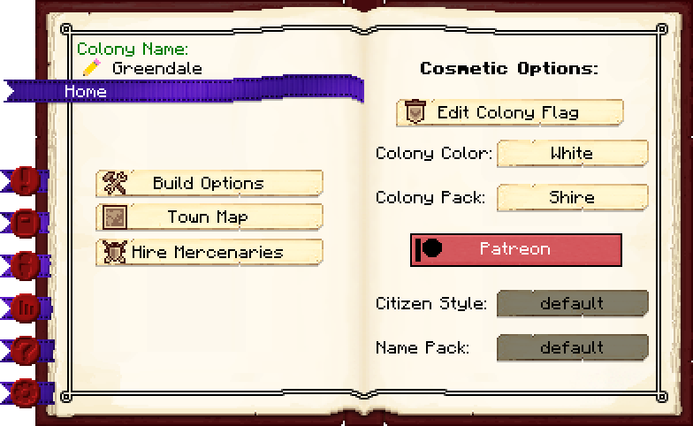 | 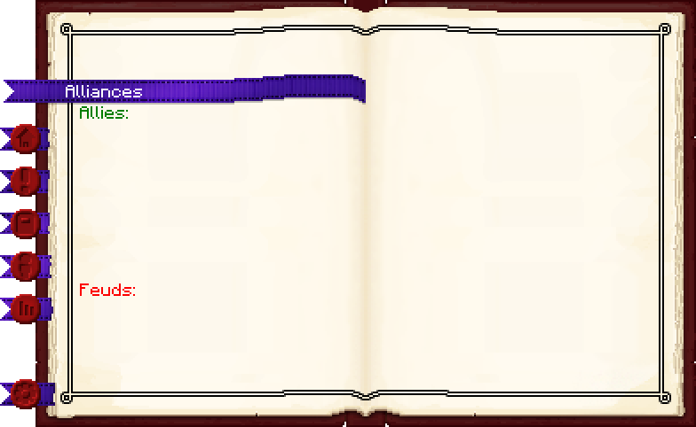 |

| Cidadãos | Estandarte da colônia |
|---|---|
| 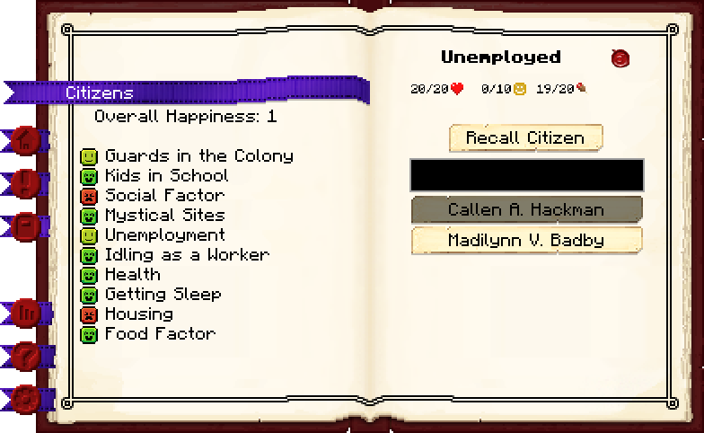 | 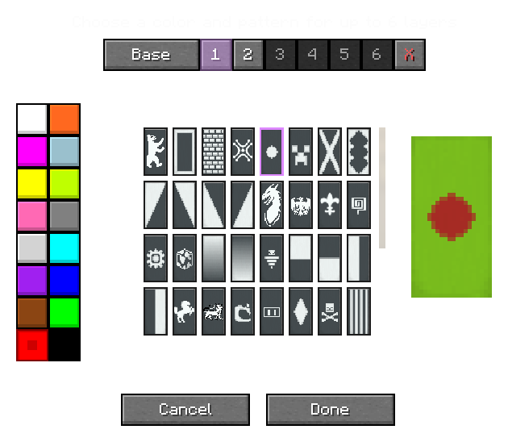 |

| Fundação da colônia | Colônia existente |
|---|---|
| 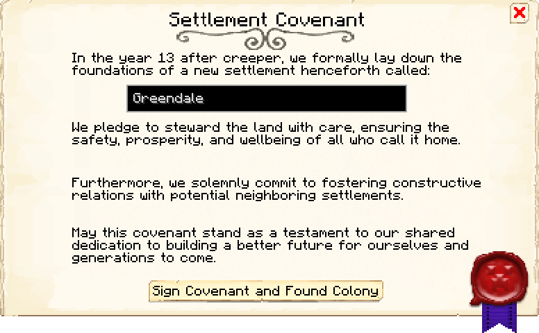 | 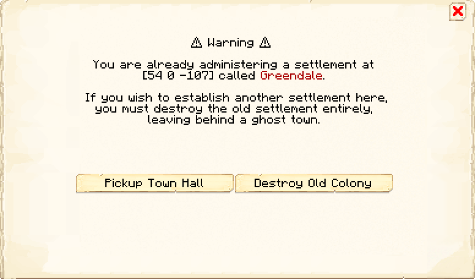 |

| Informações | Permissões 1 |
|---|---|
| 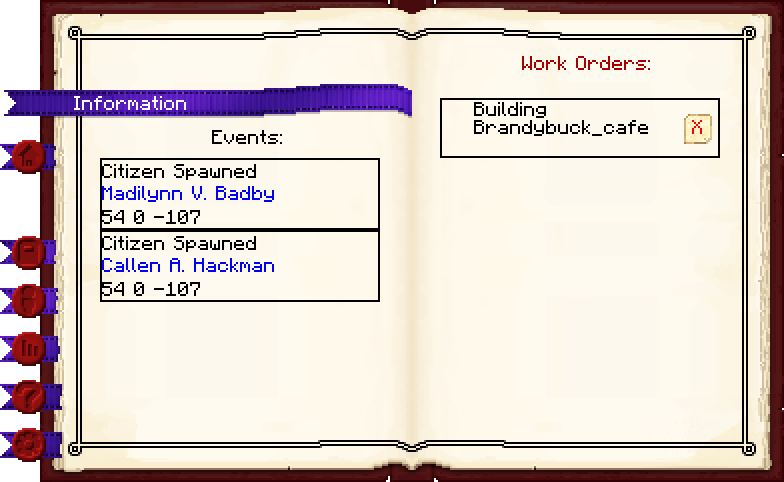 | 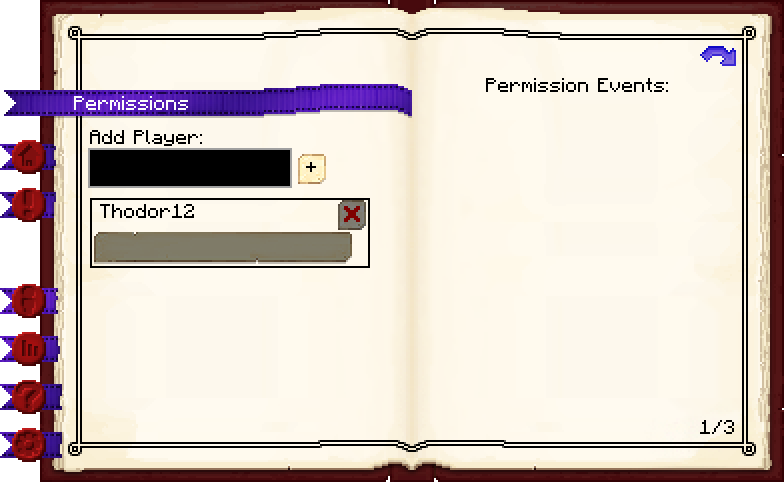 |

| Permissões 2 | Permissões 3 |
|---|---|
| 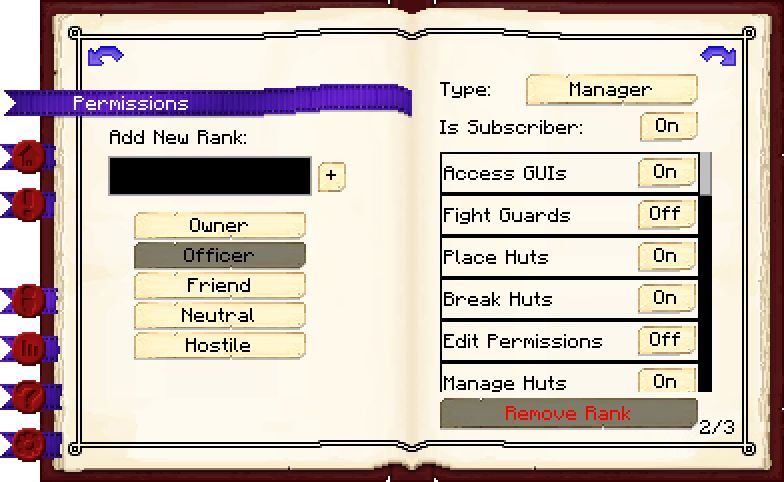 | 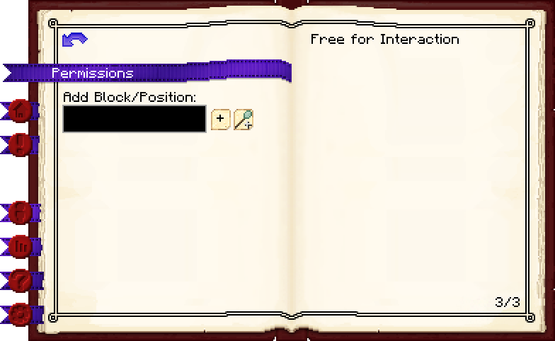 |

| Configurações da colônia | Estatísticas da colônia |
|---|---|
| 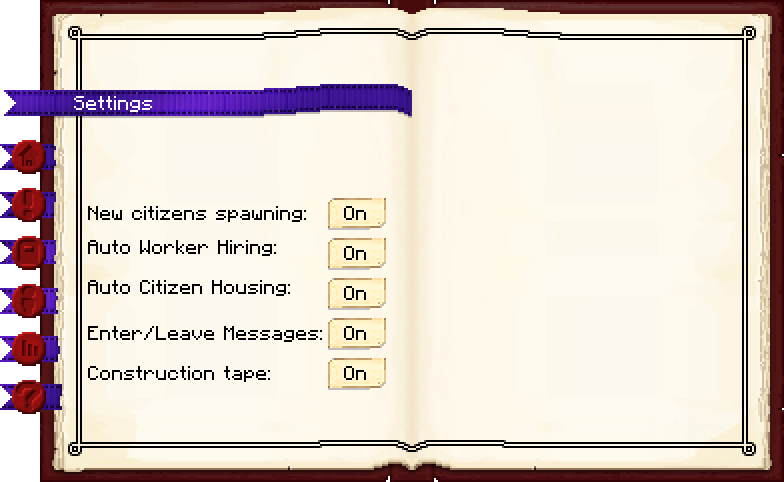 | 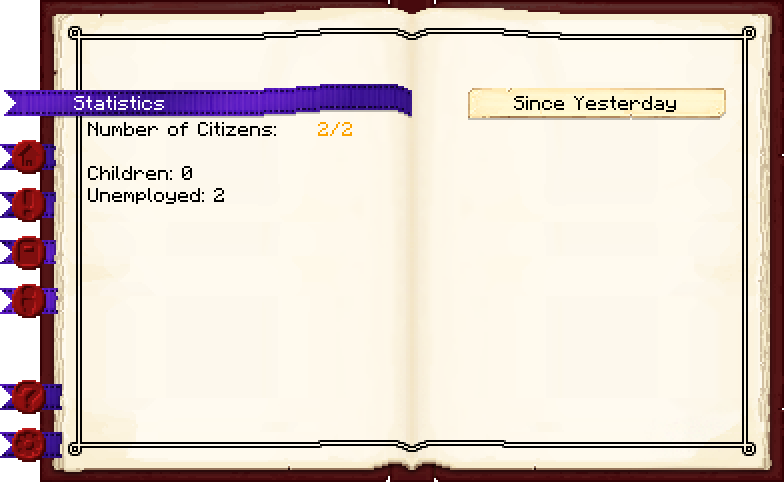 |

| Mapa da colônia |  |
|---|---|
| 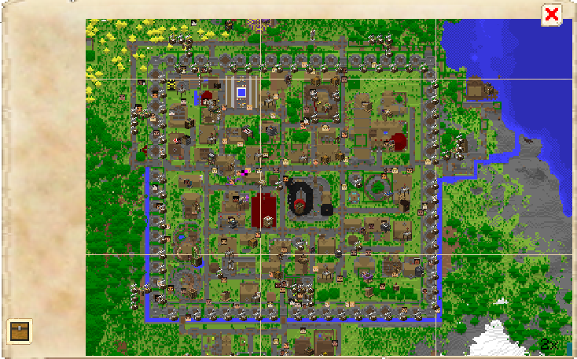 |  |

## Funções principais

- fundar e nomear a colônia;
- administrar ordens de construção;
- visualizar cidadãos, vagas e felicidade;
- controlar permissões, contratação e moradia;
- consultar eventos e estatísticas;
- administrar alianças e hostilidades;
- acessar mapa e identidade visual da colônia, quando configurados.

## Como construir

1. Obtenha o bloco no [[content/01 - Primeiros Passos/Supply Camp e Supply Ship|Supply Camp ou Ship]].
2. Escolha o terreno com cuidado.
3. Posicione com a [[content/01 - Primeiros Passos/Build Tool]].
4. Clique no bloco e funde a colônia.
5. Depois de construir a Cabana do Construtor, crie a ordem para erguer fisicamente a Prefeitura.

> [!WARNING]
> Fundar a colônia e construir o edifício são etapas diferentes. A administração básica começa no bloco; a estrutura é erguida pelo construtor.

## Interface essencial

### Actions

Permite renomear a colônia e criar ordens de construção, melhoria, reparo ou reposicionamento da Prefeitura.

### Information e Work Orders

Mostra eventos e a fila global de obras. A prioridade pode ser reorganizada; excluir uma ordem ativa interrompe o trabalho.

### Citizens e Statistics

Exibe cidadãos, saúde, fome, felicidade, empregos disponíveis e estatísticas agregadas.

### Settings

Controla:

- geração de novos cidadãos;
- contratação automática;
- atribuição automática de moradia;
- mensagens de entrada e saída;
- fita de construção.

### Permissions e Alliances

Permissões definem o que outros jogadores podem fazer. Relações amigáveis ou hostis entre colônias também são administradas aqui.

## Níveis

Os cinco níveis alteram a estrutura e servem de referência para progressão administrativa. Os materiais exatos dependem do estilo escolhido e devem ser consultados na aba de recursos da ordem.

| Nível | Uso recomendado |
|---:|---|
| 1 | Centro administrativo inicial |
| 2 | Consolidação da primeira expansão |
| 3 | Marco intermediário; habilita teleporte para colônias aliadas quando permitido |
| 4 | Administração de colônia grande |
| 5 | Estrutura administrativa final do estilo |

## Dicas de posicionamento

- Centralize em relação à área que pretende proteger, não apenas às primeiras cabanas.
- Reserve uma praça e caminhos largos.
- Visualize o nível 5 antes de confirmar.
- Evite encostar o centro em oceanos, montanhas ou territórios vizinhos.

## Problemas frequentes

### Não consigo fundar

Verifique conflitos com outra colônia, limites do servidor e permissões.

### A Prefeitura existe, mas não foi construída

Construa a Cabana do Construtor e crie a ordem em **Opções de construção** (*Build Options*).

### Um cidadão está preso

Use a lista de cidadãos para chamá-lo de volta e depois corrija o caminho.

## Construções relacionadas

- [[content/03 - Construções/Produção/Builder's Hut - Cabana do Construtor]]
- [[content/03 - Construções/Moradia/Residence - Residência do Cidadão]]
- [[content/03 - Construções/Transporte/Warehouse - Armazém]]

## Fontes

- [Town Hall — Wiki oficial do MineColonies](https://minecolonies.com/wiki/buildings/townhall/)
- [Getting Started — Wiki oficial do MineColonies](https://minecolonies.com/wiki/tutorials/getting-started/)
