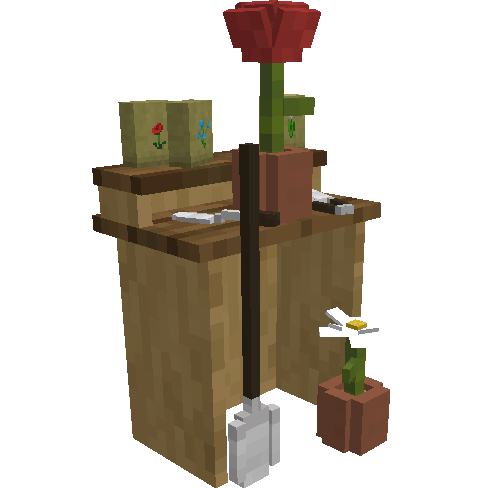
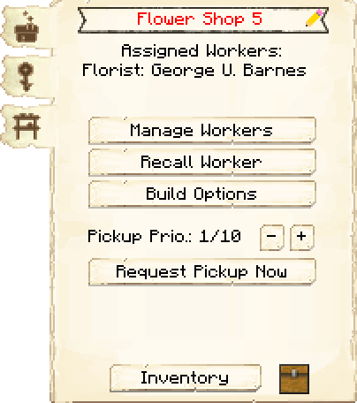
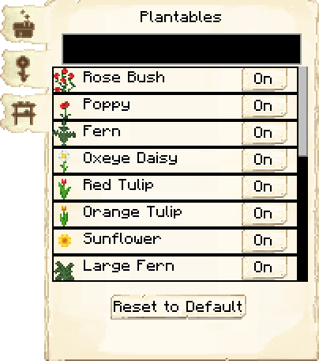
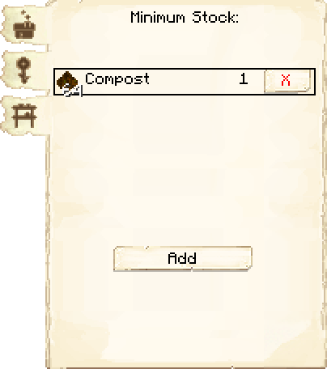

# Flowershop — Floricultura

<!-- ficha-visual: bloco -->

## Galeria — Medieval Dark Oak

| Frente | Traseira |
|---|---|
| ![[assets/construcoes/medieval-dark-oak/agriculture/horticulture/florist/front.jpg]] | ![[assets/construcoes/medieval-dark-oak/agriculture/horticulture/florist/back.jpg]] |

## Visão geral

O florista usa composto e machado para produzir flores. A construção exige **Flower Power**.

## Interface do bloco

<!-- galeria-interface -->
### Galeria da interface

| Principal | Cultivos |
|---|---|
|  |  |

| Estoque mínimo |  |
|---|---|
|  |  |

## Produção diária

| Nível | Plantas |
|---:|---:|
| 1 | 4 |
| 2 | 8 |
| 3 | 12 |
| 4 | 16 |
| 5 | 20 |

Antes do nível 3, cultiva apenas papoulas e dentes-de-leão. A partir do nível 3, a lista **Plantables** permite escolher as flores autorizadas.

Em 1259-snapshot, a colheita passou a considerar corretamente o florista e sua ferramenta ao consultar os itens obtidos. Isso corrige plantas como samambaias e grama, cujos itens obtidos dependem da ferramenta exigida pela tabela de saque.

## Habilidades

- **Dexterity:** aumenta a chance de colheita bem-sucedida.
- **Agility:** reduz o tempo de crescimento.

## Cadeia

Cabana do Compostador → composto → Floricultura → flores → tingidor’s Hut ou decoração.

## Profissão

[[content/04 - Profissões/Florist - Florista]]

## Fontes

- [Flowershop — Wiki oficial do MineColonies](https://minecolonies.com/wiki/buildings/florist/)
- [PR #11685 — correção da colheita do Florist](https://github.com/ldtteam/minecolonies/pull/11685)
