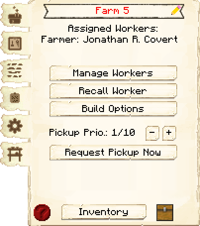
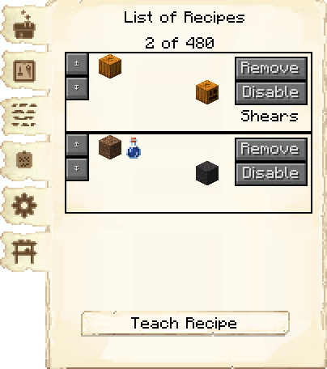
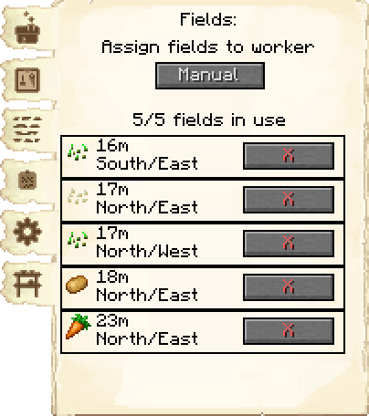
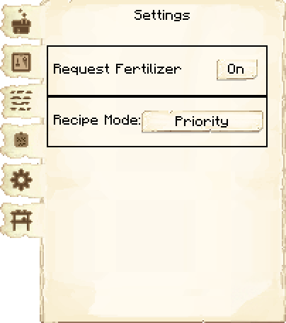
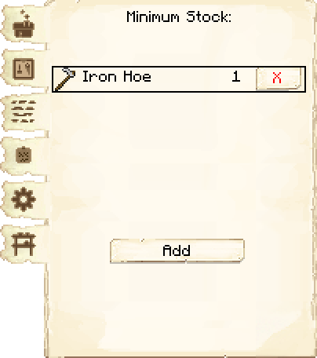
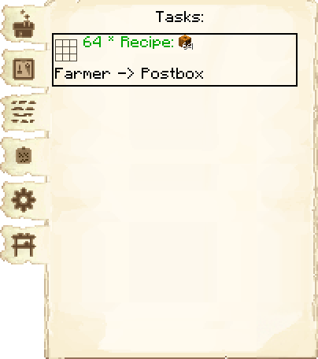

# Field — Campo

<!-- ficha-visual: bloco -->

## Visão geral

O campo é o bloco de controle da área cultivada pelo Farmer. Ele se parece com um espantalho e não funciona como uma cabana independente: precisa ser associado a uma Cabana do Fazendeiro.

## Interface do bloco

<!-- galeria-interface -->
### Galeria da interface

| Principal | Receitas de fabricação |
|---|---|
|  |  |

| Campos | Configurações |
|---|---|
|  |  |

| Estoque mínimo | Tarefas |
|---|---|
|  |  |

## Dimensões

O campo pode ocupar até **11 × 11 blocos**, com o bloco de controle no centro e cinco blocos úteis em cada direção.

## Configuração

1. Coloque o campo em terreno plano e livre.
2. Abra sua interface e escolha a semente.
3. Confirme se a Cabana do Fazendeiro possui capacidade para outro campo.
4. Mantenha água e condições exigidas pela cultura.
5. Deixe acesso livre para o Farmer.

## Lanterna do espantalho

Em 1259-snapshot, o campo pode exibir uma lanterna acesa. Projetistas de esquemas também podem deixar essa opção ativada por padrão; nesse caso, a lanterna passa a integrar os materiais exigidos pela construção.

A lanterna acompanha as duas partes do bloco e é devolvida quando o campo é quebrado. Não existe uma interação separada para removê-la sem quebrar o bloco, pois o clique já abre a interface do campo.

> [!NOTE] Ritmo de produção
> O Farmer realiza uma ação por campo a cada dia de jogo. Um campo recém-criado pode precisar de dias separados para ser arado, plantado e colhido.

## Planejamento

- distribua culturas diferentes entre os campos;
- priorize ingredientes usados pelo cardápio atual;
- reserve uma área retangular sem caminhos atravessando a plantação;
- não crie mais campos do que o nível da Cabana do Fazendeiro permite.

## Construção relacionada

- [[content/03 - Construções/Alimentação/Farmer's Hut - Cabana do Fazendeiro]]

## Fontes

- [Farmer's Hut e Fields — Wiki oficial do MineColonies](https://minecolonies.com/wiki/buildings/farmer/)
- [PR #11690 — lanterna no scarecrow](https://github.com/ldtteam/minecolonies/pull/11690)
