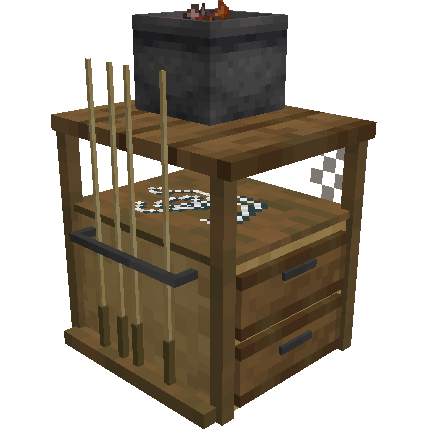
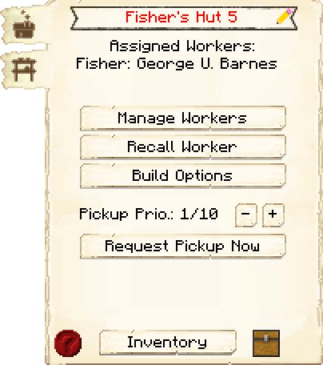
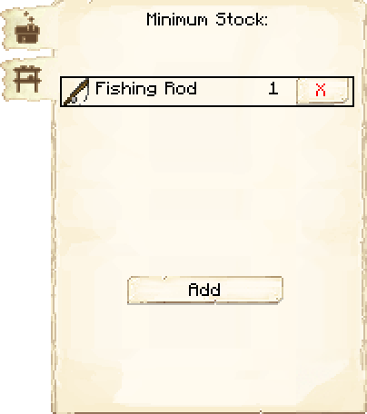

# Fisher's Hut — Cabana do Pescador

<!-- ficha-visual: bloco -->

## Galeria — Medieval Dark Oak

| Vista frontal | Vista traseira |
|---|---|
| ![[assets/construcoes/medieval-dark-oak/agriculture/husbandry/fisherman/front.jpg]] | ![[assets/construcoes/medieval-dark-oak/agriculture/husbandry/fisherman/back.jpg]] |

> [!INFO] Variante disponível
> O acervo também contém `agriculture/husbandry/altfisherman`.

## Visão geral

O Fisher captura peixes e itens adicionais usando uma vara. A cabana exige um corpo d'água próximo com pelo menos **7 × 7 blocos e 2 de profundidade**.

## Interface do bloco

<!-- galeria-interface -->
### Galeria da interface

| Principal | Estoque mínimo |
|---|---|
|  |  |

## Evolução

Melhorias ampliam o alcance de trabalho e aumentam a variedade de itens que podem ser obtidos. Em biomas oceânicos, o Fisher também pode encontrar tesouros.

## Habilidades do trabalhador

- **Focus:** reduz o tempo necessário para uma captura.
- **Agility:** também contribui para capturas mais rápidas.

## Posicionamento

- valide a água antes de confirmar o esquema;
- mantenha a margem acessível e sem barreiras;
- prefira um lago amplo ou litoral;
- conecte a cabana por estrada ao Armazém e ao Salão de Refeições.

## Profissão

Consulte [[content/04 - Profissões/Fisher - Pescador]].

## Fontes

- [Fisher's Hut — Wiki oficial do MineColonies](https://minecolonies.com/wiki/buildings/fisherman/)
