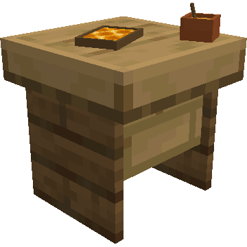
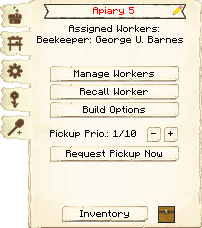
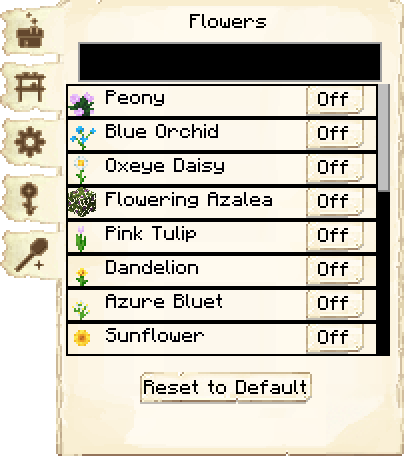
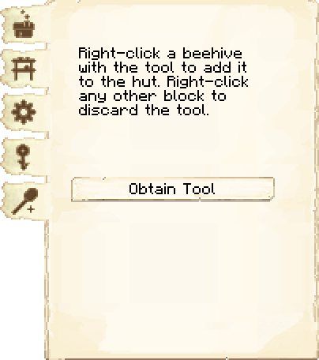
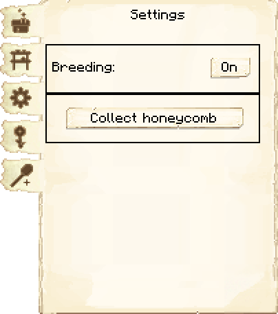
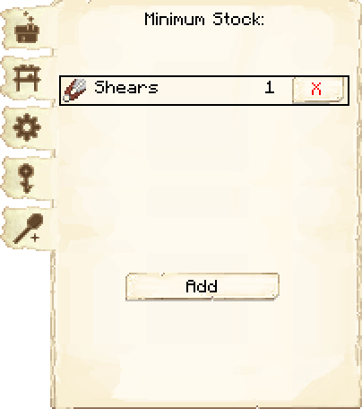

# Apiary — Apiário

<!-- ficha-visual: bloco -->

## Galeria — Medieval Dark Oak

| Frente | Traseira |
|---|---|
| ![[assets/construcoes/medieval-dark-oak/agriculture/husbandry/beekeeper/front.jpg]] | ![[assets/construcoes/medieval-dark-oak/agriculture/husbandry/beekeeper/back.jpg]] |

## Função

O Beekeeper cria abelhas e coleta favos, frascos de mel ou ambos. Não exige pesquisa.

| Nível | Colmeias |
|---:|---:|
| 1 | 1 |
| 2 | 2 |
| 3 | 4 |
| 4 | 8 |
| 5 | 16 |

Associe colmeias com a ferramenta da interface. Em **Settings**, controle reprodução e tipo de coleta; em **Flower List**, habilite flores para reprodução — todas começam desativadas.

## Habilidades

- **Dexterity:** reduz o risco de ferroada.
- **Adaptability:** reduz a espera entre verificações.

## Profissão

[[content/04 - Profissões/Beekeeper - Apicultor]]

## Interface do bloco

<!-- galeria-interface -->
### Galeria da interface

| Principal | Flores |
|---|---|
|  |  |

| Ferramenta de colmeias | Configurações |
|---|---|
|  |  |

| Estoque mínimo |  |
|---|---|
|  |  |

## Fontes
- [Apiary — Wiki oficial](https://minecolonies.com/wiki/buildings/beekeeper/)
