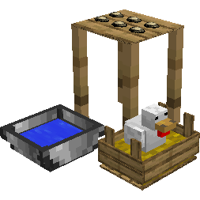
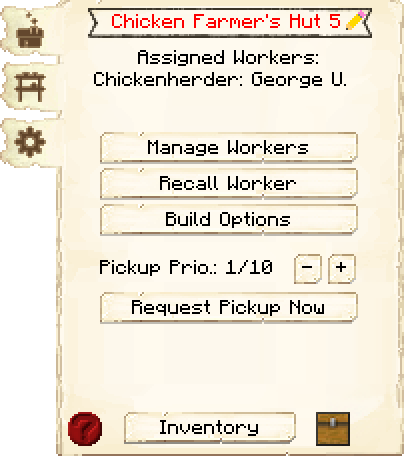
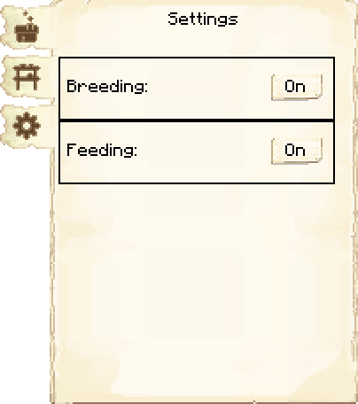
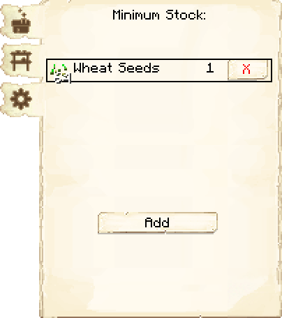

# Chicken Farmer’s Hut — Galinheiro

<!-- ficha-visual: bloco -->

## Galeria — Medieval Dark Oak

| Frente | Traseira |
|---|---|
| ![[assets/construcoes/medieval-dark-oak/agriculture/husbandry/chickenherder/front.jpg]] | ![[assets/construcoes/medieval-dark-oak/agriculture/husbandry/chickenherder/back.jpg]] |

> [!INFO] Variante disponível
> O acervo também contém `agriculture/husbandry/altchickenherder`.

## Função

O Chicken Farmer cria galinhas e coleta ovos, penas e carne. O jogador precisa levar os primeiros animais; o trabalhador não os captura.

Como nas demais cabanas de criação, o limite cresce com o nível. As opções permitem controlar reprodução e alimentação de filhotes.

## Configuração segura

- leve duas galinhas;
- mantenha sementes disponíveis;
- deixe reprodução ativa apenas quando houver demanda;
- garanta retirada de ovos e penas;
- conecte à Padaria, Fletcher e Salão de Refeições.

## Profissão

[[content/04 - Profissões/Chicken Farmer - Criador de Galinhas]]

## Interface do bloco

<!-- galeria-interface -->
### Galeria da interface

| Principal | Configurações |
|---|---|
|  |  |

| Estoque mínimo |  |
|---|---|
|  |  |

## Fontes
- [Chicken Farmer’s Hut — Wiki oficial](https://minecolonies.com/wiki/buildings/chickenherder/)
