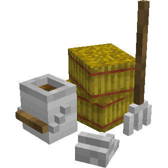
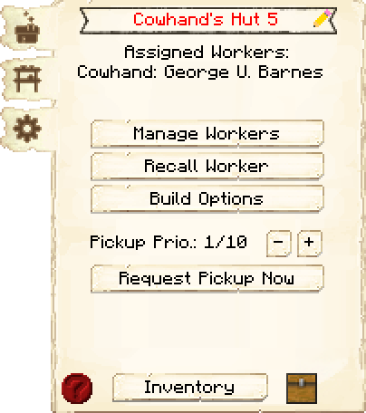
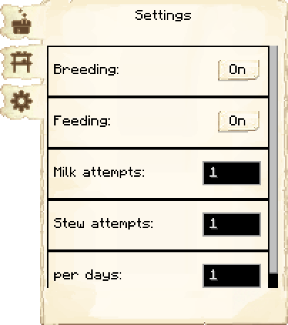
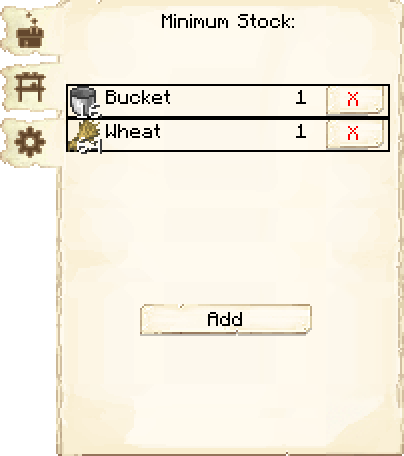

# Cowhand’s Hut — Curral

<!-- ficha-visual: bloco -->

## Galeria — Medieval Dark Oak

| Frente | Traseira |
|---|---|
| ![[assets/construcoes/medieval-dark-oak/agriculture/husbandry/cowboy/front.jpg]] | ![[assets/construcoes/medieval-dark-oak/agriculture/husbandry/cowboy/back.jpg]] |

> [!INFO] Variante disponível
> O acervo também contém `agriculture/husbandry/altcowboy`.

O Cowhand cria, ordenha e abate vacas para produzir carne, couro e leite. Também pode obter ensopado de cogumelos de mooshrooms.

| Nível | Vacas mantidas |
|---:|---:|
| 1 | 2 |
| 2 | 4 |
| 3 | 6 |
| 4 | 8 |
| 5 | 10 |

O jogador deve levar as duas primeiras vacas. As configurações controlam reprodução, alimentação, tentativas de ordenha e intervalo em dias.

## Profissão

[[content/04 - Profissões/Cowhand - Vaqueiro]]

## Interface do bloco

<!-- galeria-interface -->
### Galeria da interface

| Principal | Configurações |
|---|---|
|  |  |

| Estoque mínimo |  |
|---|---|
|  |  |

## Fontes
- [Cowhand’s Hut — Wiki oficial](https://minecolonies.com/wiki/buildings/cowboy/)
