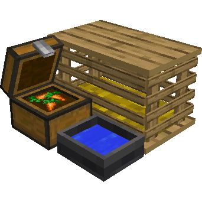
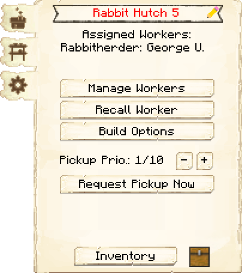
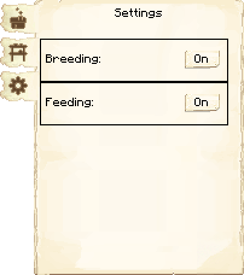
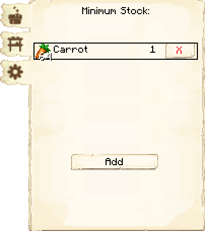

# Rabbit Hutch — Coelheira

<!-- ficha-visual: bloco -->

## Galeria — Medieval Dark Oak

| Frente | Traseira |
|---|---|
| ![[assets/construcoes/medieval-dark-oak/agriculture/husbandry/rabbithutch/front.jpg]] | ![[assets/construcoes/medieval-dark-oak/agriculture/husbandry/rabbithutch/back.jpg]] |

## Função

O Criador de Coelhos cria e abate coelhos. O jogador deve levar os dois primeiros animais.

| Nível | Coelhos mantidos |
|---:|---:|
| 1 | 2 |
| 2 | 4 |
| 3 | 6 |
| 4 | 8 |
| 5 | 10 |

**Breeding** controla reprodução e abate; **Feeding** acelera o crescimento dos filhotes.

## Habilidades

- **Agility:** aumenta a chance de acertar o animal.
- **Athletics:** acelera o crescimento.

## Profissão

[[content/04 - Profissões/Rabbit Herder - Criador de Coelhos]]

## Interface do bloco

<!-- galeria-interface -->
### Galeria da interface

| Principal | Configurações |
|---|---|
|  |  |

| Estoque mínimo |  |
|---|---|
|  |  |

## Fontes
- [Rabbit Hutch — Wiki oficial](https://minecolonies.com/wiki/buildings/rabbithutch/)
