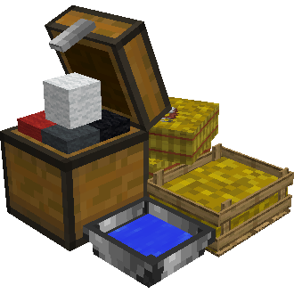
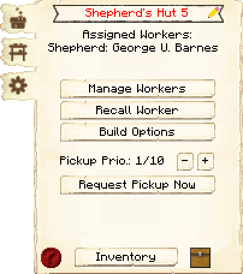
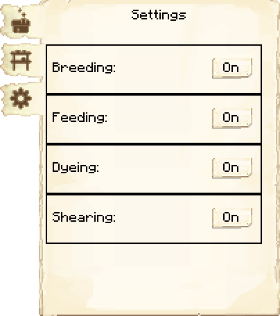
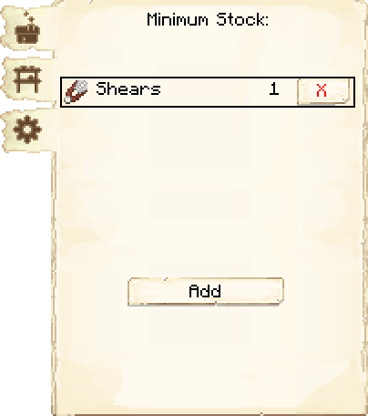

# Shepherd’s Hut — Aprisco

<!-- ficha-visual: bloco -->

## Galeria — Medieval Dark Oak

| Frente | Traseira |
|---|---|
| ![[assets/construcoes/medieval-dark-oak/agriculture/husbandry/shepherd/front.jpg]] | ![[assets/construcoes/medieval-dark-oak/agriculture/husbandry/shepherd/back.jpg]] |

O Shepherd cria e abate ovelhas, coleta lã e pode colori-las automaticamente sem consumir corante.

| Nível | Ovelhas mantidas |
|---:|---:|
| 1 | 2 |
| 2 | 4 |
| 3 | 6 |
| 4 | 8 |
| 5 | 10 |

As configurações controlam reprodução, alimentação, coloração e tosquia. O jogador fornece as duas primeiras ovelhas.

## Habilidades

- **Focus:** aumenta a lã coletada.
- **Strength:** aumenta o dano ao abater.

## Profissão

[[content/04 - Profissões/Shepherd - Pastor]]

## Interface do bloco

<!-- galeria-interface -->
### Galeria da interface

| Principal | Configurações |
|---|---|
|  |  |

| Estoque mínimo |  |
|---|---|
|  |  |

## Fontes
- [Shepherd’s Hut — Wiki oficial](https://minecolonies.com/wiki/buildings/shepherd/)
