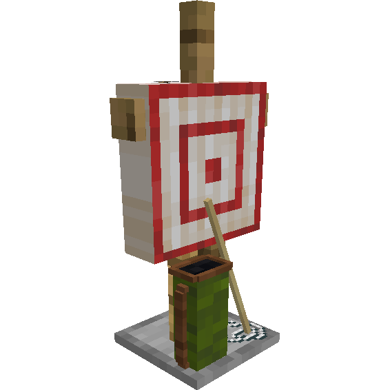
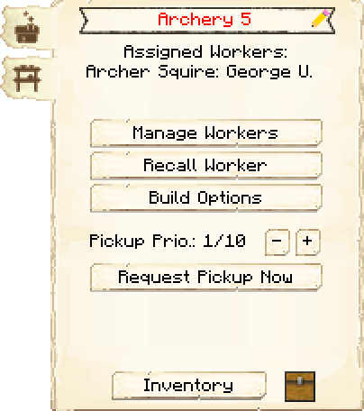
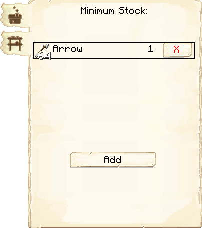

# Archery — Campo de Arquearia

<!-- ficha-visual: bloco -->

## Galeria — Medieval Dark Oak

| Frente | Traseira |
|---|---|
| ![[assets/construcoes/medieval-dark-oak/military/archery/front.jpg]] | ![[assets/construcoes/medieval-dark-oak/military/archery/back.jpg]] |

> [!INFO] Nome e variante
> A página planejada usava “arqueiro Training”; o nome oficial atual é **Campo de Arquearia**. O acervo também contém `military/altarchery`.

## Visão geral

A Campo de Arquearia treina arqueiros com segurança antes que sejam contratados por Torres de Guarda ou Torres do Quartel. Exige **Improved Bows**.

## Interface do bloco

<!-- galeria-interface -->
### Galeria da interface

| Principal | Estoque mínimo |
|---|---|
|  |  |

## Capacidade

O nível define o número de alunos simultâneos, de um no nível 1 até cinco no nível 5.

aprendizes passam a residir na Campo de Arquearia, liberando a cama anterior. Eles ainda não são guardas ativos e não ajudam durante invasões.

## Preparação

Mantenha arcos e munição disponíveis, treine antes de abrir vagas nas torres e combine arqueiros com cavaleiros que bloqueiem inimigos próximos.

## Pesquisa relacionada

No nível 3, a Campo de Arquearia atende ao requisito de construção da pesquisa **That hit the mark!**. Ela custa cinco bestas, depende de **Improved Bows** e libera o [[content/04 - Profissões/Marksman - Atirador|Marksman]] como tipo de guarda. A Campo de Arquearia continua treinando arqueiros; o atirador trabalha em Torres de Guarda e Torres do Quartel.

## Fontes

- [Archery — Wiki oficial do MineColonies](https://minecolonies.com/wiki/buildings/archery/)
- [PR #11717 — pesquisa That hit the mark!](https://github.com/ldtteam/minecolonies/pull/11717)
