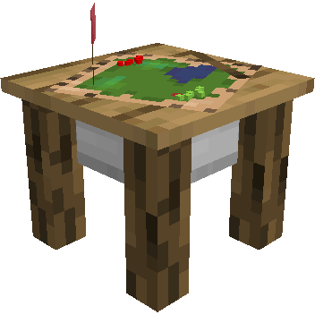
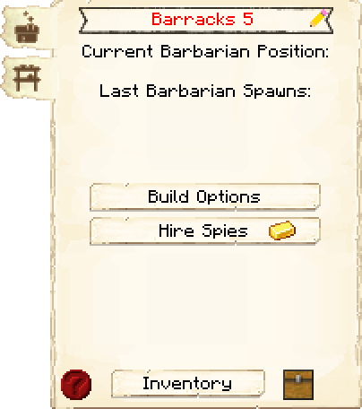
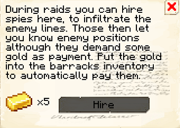
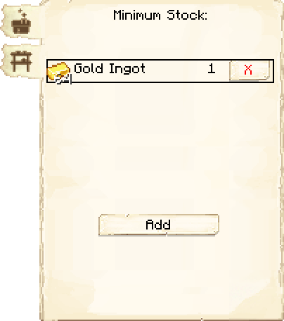

# Barracks — Quartel

<!-- ficha-visual: bloco -->

## Galeria — Medieval Dark Oak

| Frente | Traseira |
|---|---|
| ![[assets/construcoes/medieval-dark-oak/military/barracks/front.jpg]] | ![[assets/construcoes/medieval-dark-oak/military/barracks/back.jpg]] |

> [!INFO] Variante disponível
> O acervo também contém `military/altbarracks`.

## Visão geral

O Quartel reúne várias [[content/03 - Construções/Militar/Barracks Tower - Torre do Quartel|Barracks Towers]]. Nos estilos oficiais, são quatro torres, com capacidade final de até 20 guardas. Estilos personalizados podem variar. Exige **Tactic Training**.

## Interface do bloco

<!-- galeria-interface -->
### Galeria da interface

| Principal | Contratação de espiões |
|---|---|
|  |  |

| Estoque mínimo |  |
|---|---|
|  |  |

## Progressão

| Nível do Quartel | Torres disponíveis | Nível máximo das torres |
|---:|---:|---:|
| 1 | 1 | 1 |
| 2 | 2 | 2 |
| 3 | 3 | 3 |
| 4 | 4 | 4 |
| 5 | 4 | 5 |

Cada [[content/03 - Construções/Militar/Barracks Tower - Torre do Quartel|Barracks Tower]] abriga um guarda por nível. As torres internas só podem alcançar o nível do Quartel.

## Recursos táticos

A partir do nível 3, o Quartel pode contratar espiões durante invasões para destacar inimigos. Torres configuram patrulha, guarda, acompanhamento, hostis e equipamento individualmente.

As Torres do Quartel aceitam cavaleiro, arqueiro, Druida e, após as pesquisas correspondentes, os novos guardas [[content/04 - Profissões/Huscarl - Huscarl|Huscarl]] e [[content/04 - Profissões/Marksman - Atirador|Marksman]].

## Posicionamento

Reserve uma área grande e coloque o complexo próximo ao setor mais vulnerável, sem afastá-lo tanto que entregadores e guardas percam tempo em deslocamento.

## Fontes

- [Barracks — Wiki oficial do MineColonies](https://minecolonies.com/wiki/buildings/barracks/)
- [Barracks Tower — Wiki oficial](https://minecolonies.com/wiki/buildings/barrackstower/)
- [PR #11717 — novos tipos de Guard](https://github.com/ldtteam/minecolonies/pull/11717)
