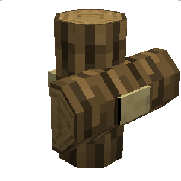
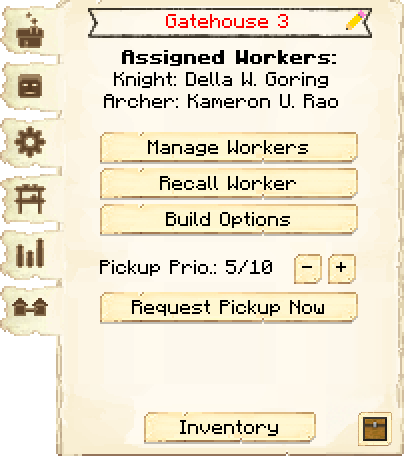
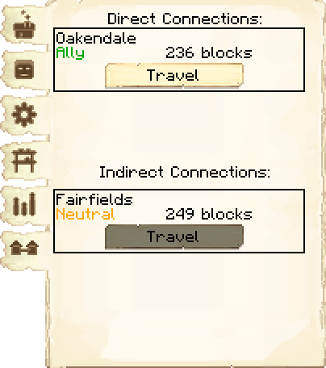
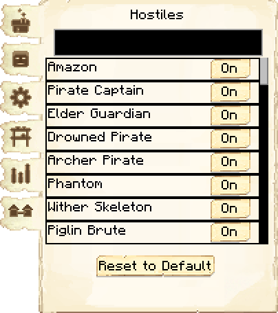
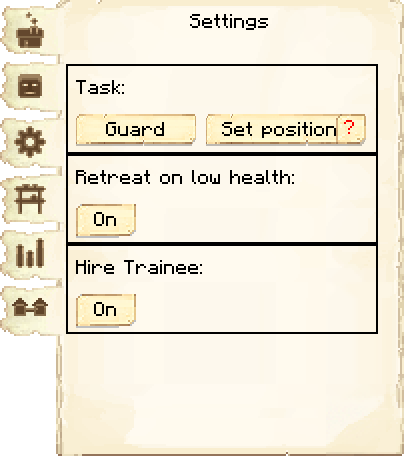
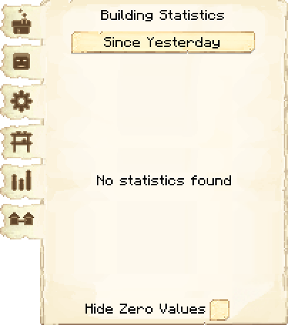
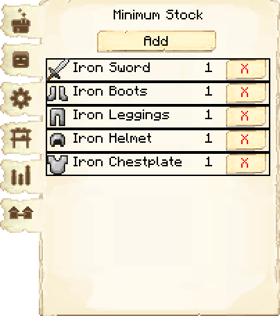

# Gatehouse — Portaria

## Visão geral

A Portaria é uma construção militar de acesso que posiciona dois guardas na entrada da colônia e participa do sistema de conexões entre colônias. Ela é uma construção administrável, mas seu esquema incorpora um **Gate** normal para controlar fisicamente a passagem.

> [!WARNING] Recurso em evolução
> A Portaria está presente na versão de referência, mas suas funções de conexão continuam sendo expandidas pelo mod. Confirme na interface disponível no jogo quais ações estão habilitadas no seu snapshot e no servidor.

## Galeria da construção

| Frente | Fundos |
|---|---|
| ![[assets/construcoes/medieval-dark-oak/walls/gate/gate/front.jpg]] | ![[assets/construcoes/medieval-dark-oak/walls/gate/gate/back.jpg]] |

## Interface do bloco

<!-- galeria-interface -->
### Galeria da interface

| Principal | Conexões |
|---|---|
|  |  |

| Hostis | Configurações |
|---|---|
|  |  |

| Estatísticas | Estoque mínimo |
|---|---|
|  |  |

## Função da construção

- representar um ponto formal de entrada e saída;
- manter dois guardas em posições fixas para defender a entrada;
- registrar conexões disponíveis com outras colônias;
- exibir informações relacionadas ao destino conectado;
- organizar um gargalo defensivo sem substituir toda a cobertura de Torres de Guarda.

## Trabalhadores responsáveis

A Portaria aceita **dois Cavaleiros**, **dois Arqueiros** ou **um de cada**. Eles permanecem nos postos definidos pelo esquema em vez de patrulhar, mas entram em combate quando um inimigo os enfrenta.

- [[content/04 - Profissões/Archer - Arqueiro|Archer — Arqueiro]]: treinado no [[content/03 - Construções/Militar/Archery - Campo de Arquearia]].
- [[content/04 - Profissões/Knight - Cavaleiro|Knight — Cavaleiro]]: treinado na [[content/03 - Construções/Militar/Combat Academy - Academia de Combate]].

## Progressão

A Portaria possui **três níveis**. O esquema precisa incluir as marcações de portão, arqueiro e cavaleiro para que a construção funcione corretamente, e cada melhoria deve permanecer compatível com o nível da Prefeitura.

## Configurações e interface

- confira a área de conexões antes de planejar uma rota externa;
- mantenha o nome da construção descritivo quando houver várias entradas;
- verifique se a ligação pretendida está disponível para as colônias envolvidas;
- não trate uma conexão exibida como garantia de proteção militar ou transporte automático.

## Dicas de posicionamento

> [!NOTE] Análise do Vault
> A melhor posição é uma entrada que já faça sentido para o terreno: ponte, estrada, desfiladeiro ou abertura da muralha. A Portaria organiza o fluxo; Torres de Guarda e Torres do Quartel continuam responsáveis pela cobertura de combate.

- visualize o nível 3 para garantir passagem livre;
- alinhe a construção à estrada principal;
- cubra os dois lados do acesso com linhas de visão defensivas;
- evite criar uma única saída sem rota alternativa para entregadores e cidadãos;
- teste a navegação antes de fechar muralhas e decorações ao redor.

## Gatehouse e portões

A Portaria e os **Gates** são elementos diferentes, mas trabalham juntos. O [[content/09 - Referências/Itens/Wooden Gate - Portão de Madeira|Portão de Madeira]] ou o [[content/09 - Referências/Itens/Iron Gate - Portão de Ferro|Portão de Ferro]] controla fisicamente a passagem; a Portaria fornece a construção, os dois postos de guarda e a interface de conexões.

## Construções relacionadas

- [[content/03 - Construções/Militar/Guard Tower - Torre de Guarda]]
- [[content/03 - Construções/Militar/Barracks - Quartel]]
- [[content/03 - Construções/Militar/Barracks Tower - Torre do Quartel]]
- [[content/03 - Construções/Administração/Town Hall - Prefeitura]]

## Fontes

- [Gatehouse — Wiki oficial do MineColonies](https://minecolonies.com/wiki/buildings/gatehouse/)
- [Colony Connections — Wiki oficial do MineColonies](https://minecolonies.com/wiki/systems/colonyconnections/)
- [Gates — Wiki oficial do MineColonies](https://minecolonies.com/wiki/items/gates/)

