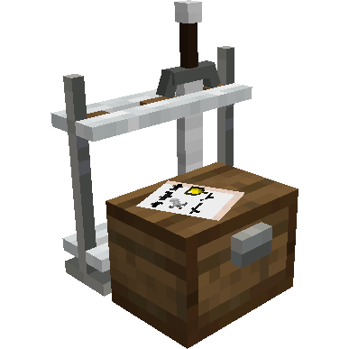
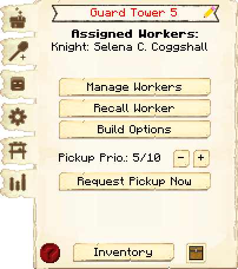
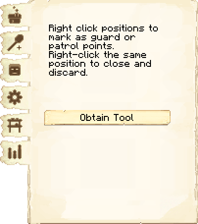
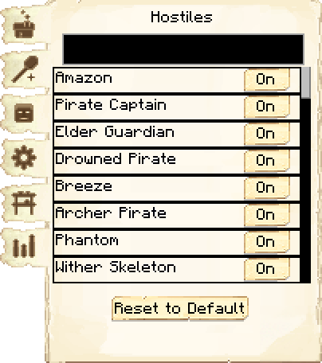
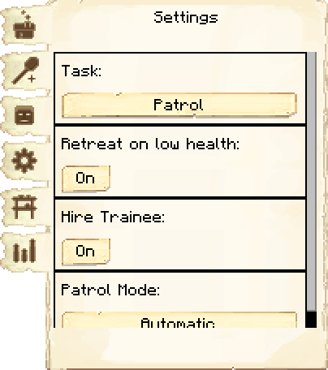
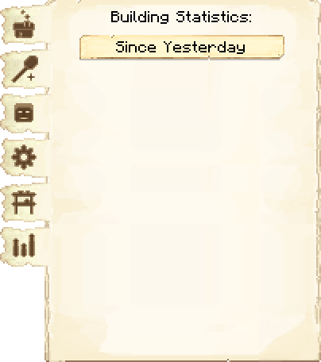
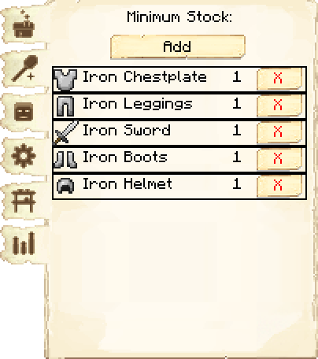

# Guard Tower — Torre de Guarda

<!-- ficha-visual: bloco -->

## Galeria — Medieval Dark Oak

| Frente | Traseira |
|---|---|
| ![[assets/construcoes/medieval-dark-oak/military/guardtower/front.jpg]] | ![[assets/construcoes/medieval-dark-oak/military/guardtower/back.jpg]] |

> [!INFO] Variante disponível
> O acervo também contém `military/altguardtower`.

## Visão geral

A Torre de Guarda emprega e abriga um guarda. Torres próximas de casas e trabalhos aumentam a sensação de segurança e, quando posicionadas perto da borda, ajudam na expansão territorial.

## Interface do bloco

<!-- galeria-interface -->
### Galeria da interface

| Principal | Ferramenta de patrulha |
|---|---|
|  |  |

| Hostis | Configurações |
|---|---|
|  |  |

| Estatísticas | Estoque mínimo |
|---|---|
|  |  |

## Alcance

| Nível | Distância máxima de patrulha |
|---:|---:|
| 1 | 80 blocos |
| 2 | 110 blocos |
| 3 | 140 blocos |
| 4 | 170 blocos |
| 5 | 200 blocos |

O aumento do alcance permite cobrir rotas mais longas, mas cada Torre de Guarda continua abrigando um único guarda. Melhorar a torre amplia sua área operacional; distribuir torres continua necessário para eliminar pontos cegos.

## Tarefas

- **Patrulhar** (*Patrol*): percorre cabanas automaticamente ou pontos manuais.
- **Defender posição** (*Guard*): permanece defendendo uma posição.
- **Seguir** (*Follow*): acompanha o jogador, inclusive fora da colônia.

Use o **guarda Scepter** para definir postos e rotas. Configure a lista de hostis, retirada com pouca vida e estoque mínimo de equipamento.

Em 1259-snapshot, guardas ignoram pontos de patrulha em chunks descarregados. Isso evita tentativas repetidas de alcançar uma área indisponível, mas significa que a rota só volta a ser percorrida quando o local estiver carregado.

## Posicionamento

Cubra acessos, bairros residenciais, produtores isolados e pontos cegos. Evite sobrepor todas as torres no centro enquanto a borda permanece aberta.

## Profissões

- [[content/04 - Profissões/Knight - Cavaleiro]]
- [[content/04 - Profissões/Archer - Arqueiro]]
- [[content/04 - Profissões/Druid - Druida]]
- [[content/04 - Profissões/Huscarl - Huscarl]] — requer **Sliced and Diced!**
- [[content/04 - Profissões/Marksman - Atirador]] — requer **That hit the mark!**

## Fontes

- [Guard Tower — Wiki oficial do MineColonies](https://minecolonies.com/wiki/buildings/guardtower/)
- [PR #11717 — novos tipos de Guard](https://github.com/ldtteam/minecolonies/pull/11717)
- [PR #11736 — cidadãos e patrulhas em áreas descarregadas](https://github.com/ldtteam/minecolonies/pull/11736)
