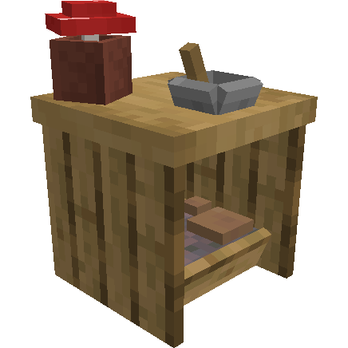
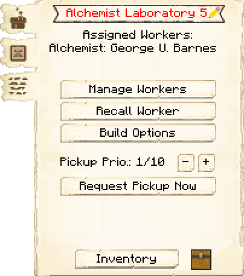
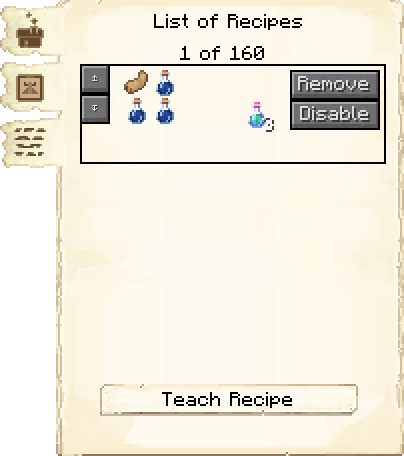
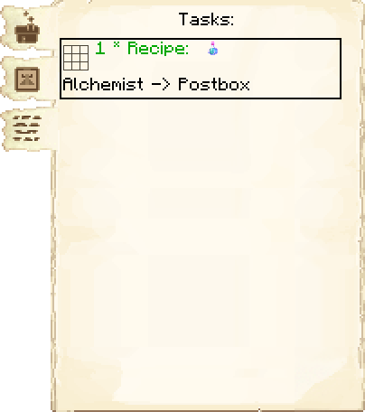

# Alchemist Laboratory — Laboratório do Alquimista

<!-- ficha-visual: bloco -->

## Galeria — Medieval Dark Oak

| Frente | Traseira |
|---|---|
| ![[assets/construcoes/medieval-dark-oak/craftsmanship/luxury/alchemist/front.jpg]] | ![[assets/construcoes/medieval-dark-oak/craftsmanship/luxury/alchemist/back.jpg]] |

## Função

O Alquimista produz poções ensinadas ao laboratório usando suportes de poções. Exige a pesquisa **Magic Potions** e uma cadeia estável de frascos, ingredientes e combustível de alquimia.

## Habilidades

**Destreza** (*Dexterity*) acelera a preparação; **Mana** permite utilizar mais suportes de poções.

## Quando construir

É uma oficina avançada. Priorize depois de Armazém, University e produtores básicos, quando a colônia conseguir manter ingredientes raros sem interromper cadeias essenciais.

## Profissão

[[content/04 - Profissões/Alchemist - Alquimista]]

## Interface do bloco

<!-- galeria-interface -->
### Galeria da interface

| Principal | Receitas de poções |
|---|---|
|  |  |

| Tarefas |  |
|---|---|
|  |  |

## Fontes
- [Alchemist Laboratory — Wiki oficial do MineColonies](https://minecolonies.com/wiki/buildings/alchemist/)
