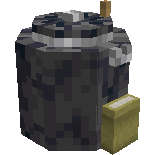
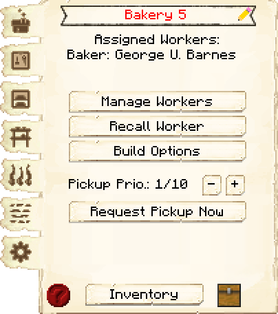
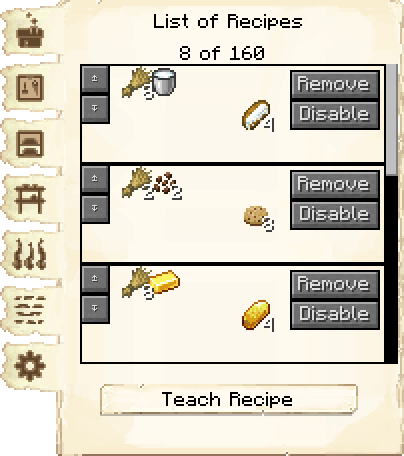
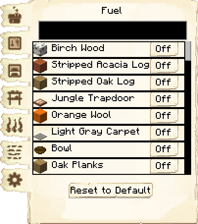
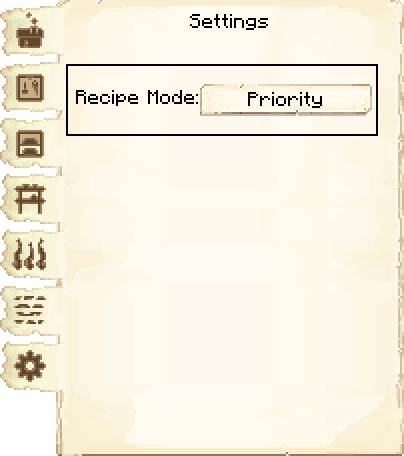
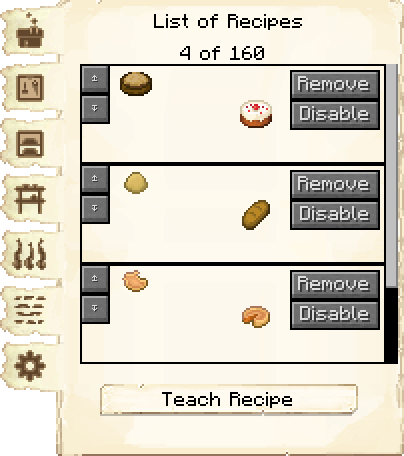
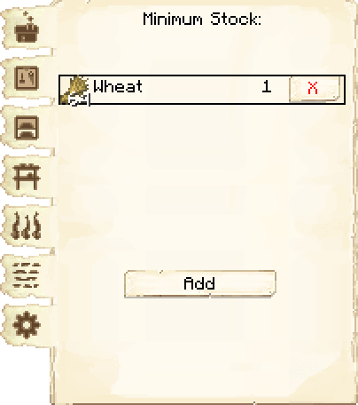
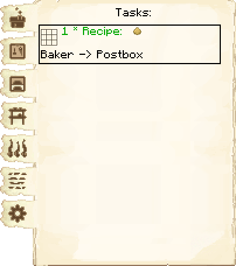

# Bakery — Padaria

<!-- ficha-visual: bloco -->

## Galeria — Medieval Dark Oak

| Frente | Traseira |
|---|---|
| ![[assets/construcoes/medieval-dark-oak/craftsmanship/luxury/baker/front.jpg]] | ![[assets/construcoes/medieval-dark-oak/craftsmanship/luxury/baker/back.jpg]] |

> [!INFO] Variante disponível
> O acervo também contém `craftsmanship/luxury/altbaker`.

## Função

O Baker prepara massas e assa pão, biscoitos, bolos e tortas de abóbora. Trabalha sob pedido do Waiter, Postbox ou estoque mínimo do Armazém. Não exige pesquisa.

## Habilidades

**Conhecimento** (*Knowledge*) pode economizar ingredientes; **Destreza** (*Dexterity*) acelera fabricação e forno.

## Configuração recomendada

Ligue a Padaria à produção de trigo, açúcar, ovos e abóboras. Defina estoque mínimo apenas para produtos cuja cadeia agrícola seja sustentável.

## Mudanças em 1259-snapshot

- **Flatbread:** a receita passou a produzir duas unidades;
- **Muffin Dough:** passou a usar ovo e teve custo e rendimento ajustados;
- **Mushroom Pizza:** passou a consumir menos durum;
- **garrafas:** a chance de quebra das garrafas de vidro e garrafas grandes usadas pelo Baker foi reduzida pela metade.

Mesmo com a perda menor, mantenha garrafas vazias em estoque para que pedidos em sequência não parem a produção.

## Profissão

[[content/04 - Profissões/Baker - Padeiro]]

## Interface do bloco

<!-- galeria-interface -->
### Galeria da interface

| Principal | Receitas de fabricação |
|---|---|
|  |  |

| Combustível | Configurações |
|---|---|
|  |  |

| Receitas de fundição | Estoque mínimo |
|---|---|
|  |  |

| Tarefas |  |
|---|---|
|  |  |

## Fontes
- [Bakery — Wiki oficial do MineColonies](https://minecolonies.com/wiki/buildings/baker/)
- [PR #11683 — Food Adjustments #1](https://github.com/ldtteam/minecolonies/pull/11683)
- [PR #11714 — Bottle safety](https://github.com/ldtteam/minecolonies/pull/11714)
