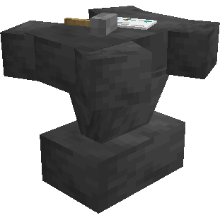
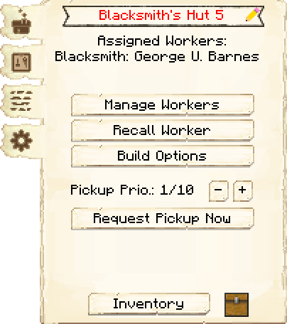
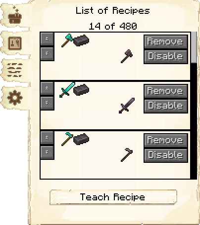
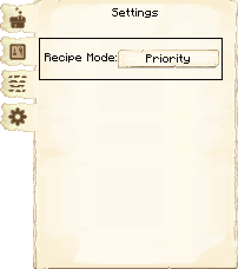
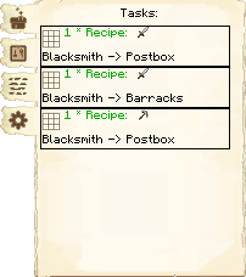

# Blacksmith's Hut — Ferraria

<!-- ficha-visual: bloco -->

## Galeria — Medieval Dark Oak

| Frente | Traseira |
|---|---|
| ![[assets/construcoes/medieval-dark-oak/craftsmanship/metallurgy/blacksmith/front.jpg]] | ![[assets/construcoes/medieval-dark-oak/craftsmanship/metallurgy/blacksmith/back.jpg]] |

## Função

O Ferreiro fabrica ferramentas, armaduras, espadas e escudos do jogo base, mas não arcos nem itens de redstone. Exige **Hitting Iron!**.

## Evolução

Aprende 10, 20, 40, 80 e 160 receitas. No nível 5 recebe as nove receitas de netherita, que contam no limite.

## Habilidades

**Força** (*Strength*) acelera a fabricação; **Concentração** (*Focus*) pode reduzir materiais.

## Estratégia

Ensine primeiro ferramentas usadas por vários trabalhadores e ordene receitas por material, do mais sustentável ao mais raro.

## Profissão

[[content/04 - Profissões/Blacksmith - Ferreiro]]

## Interface do bloco

<!-- galeria-interface -->
### Galeria da interface

| Principal | Receitas de fabricação |
|---|---|
|  |  |

| Configurações | Tarefas |
|---|---|
|  |  |

## Fontes
- [Blacksmith's Hut — Wiki oficial do MineColonies](https://minecolonies.com/wiki/buildings/blacksmith/)
