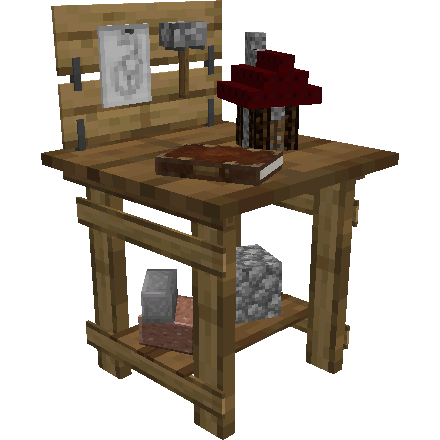
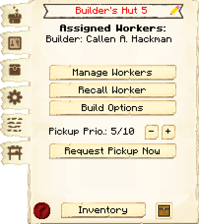
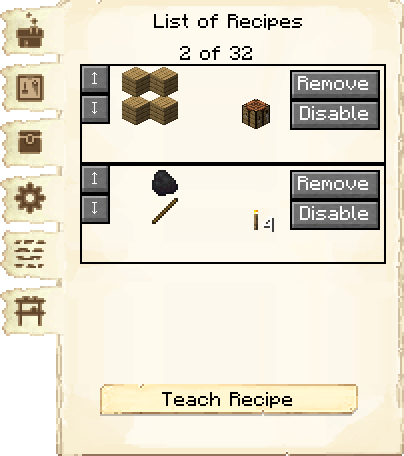
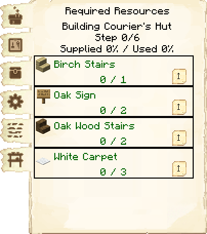
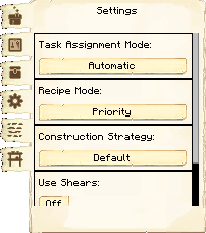
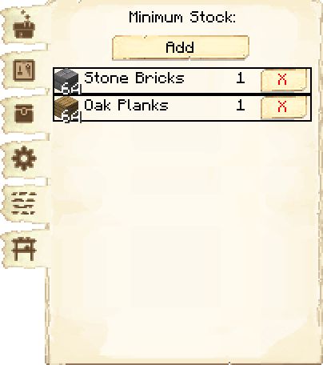
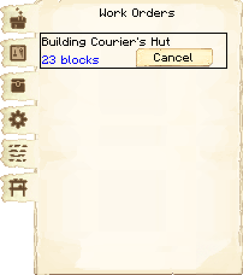

# Builder's Hut — Cabana do Construtor

<!-- ficha-visual: bloco -->

## Galeria — Medieval Dark Oak

| Vista frontal | Vista traseira |
|---|---|
| ![[assets/construcoes/medieval-dark-oak/fundamentals/builder/front.jpg]] | ![[assets/construcoes/medieval-dark-oak/fundamentals/builder/back.jpg]] |

> [!INFO] Variante disponível
> O acervo também contém `fundamentals/altbuilder`.

## Visão geral

É a primeira construção funcional obrigatória. Sem ela, o construtor não pode erguer as demais cabanas.

## Função

- hospedar o posto de construtor;
- receber materiais das obras;
- mostrar recursos necessários;
- administrar ordens atribuídas;
- manter estoque mínimo;
- limitar o nível máximo que esse construtor consegue construir.

> [!IMPORTANT] Regra de progressão
> Um construtor só constrói ou melhora outros edifícios até o nível da própria Cabana do Construtor. Para construir um edifício de nível 3, a cabana desse construtor precisa estar pelo menos no nível 3.

## Como construir

1. Fabrique o bloco da Cabana do Construtor.
2. Posicione-o com a [[content/01 - Primeiros Passos/Build Tool]].
3. Abra o bloco e crie a ordem de construção.
4. Um cidadão será atribuído automaticamente, salvo configuração manual.
5. Coloque os materiais solicitados no bloco ou nos estantes.

## Níveis

| Nível | Capacidade estratégica |
|---:|---|
| 1 | Permite construir edifícios de nível 1 |
| 2 | Libera obras e melhorias até o nível 2 |
| 3 | Libera obras e melhorias até o nível 3 |
| 4 | Libera obras e melhorias até o nível 4 |
| 5 | Libera obras e melhorias até o nível 5 |

Os materiais e a aparência variam conforme o esquema Medieval Dark Oak.

## Interface

<!-- galeria-interface -->
### Galeria da interface

| Principal | Receitas de fabricação |
|---|---|
|  |  |

| Recursos necessários | Configurações |
|---|---|
|  |  |

| Estoque mínimo | Ordens de construção |
|---|---|
|  |  |

### Required Resources

Mostra projeto atual, etapa, percentual fornecido/usado e itens faltantes. Cores ajudam a identificar o que está ausente ou disponível no inventário do jogador.

### Work Orders

Permite atribuir e cancelar obras. A fila global também pode ser organizada na Prefeitura.

### Estoque mínimo (*Minimum Stock*)

Mantém ferramentas ou materiais recorrentes disponíveis na cabana quando a logística estiver funcionando.

## Dicas de posicionamento

- Coloque a primeira cabana perto do centro das obras iniciais.
- Evite rios, penhascos e caminhos longos.
- Reserve acesso para entregas e armazenamento.
- Em colônias grandes, use vários construtores em regiões diferentes.

## Problemas frequentes

### O construtor não começa

Verifique:

- ordem criada;
- trabalhador atribuído;
- ferramentas adequadas;
- materiais em vermelho;
- comida;
- caminho até a obra;
- outra obra já em execução.

### Uma melhoria está bloqueada

Confira se a Cabana do Construtor responsável tem nível igual ou superior ao nível desejado.

## Profissão

Consulte [[content/04 - Profissões/Builder - Construtor]].

## Fontes

- [Builder's Hut — Wiki oficial do MineColonies](https://minecolonies.com/wiki/buildings/builder/)
- [Build Tool — Wiki oficial do MineColonies](https://minecolonies.com/wiki/items/sceptergold/)
