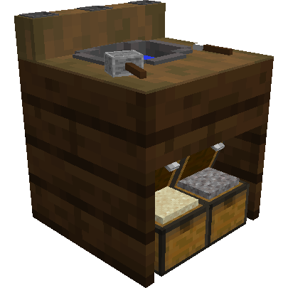
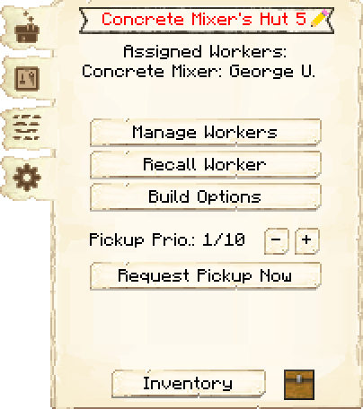
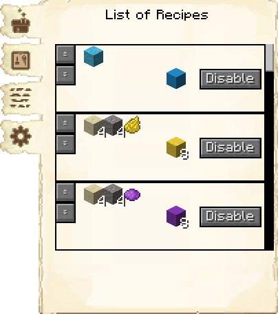
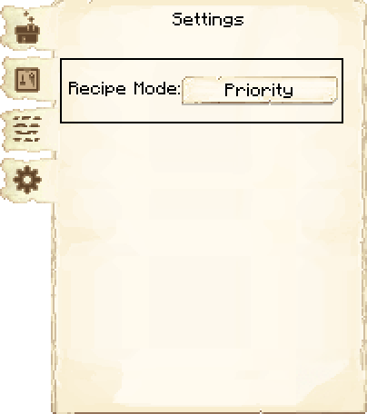
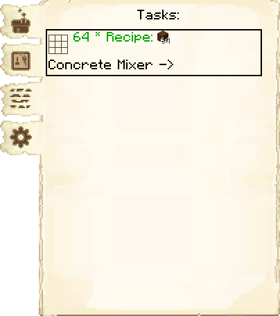

# Concrete Mixer's Hut — Oficina de Concreto

<!-- ficha-visual: bloco -->

## Galeria — Medieval Dark Oak

| Frente | Traseira |
|---|---|
| ![[assets/construcoes/medieval-dark-oak/craftsmanship/luxury/concretemixer/front.jpg]] | ![[assets/construcoes/medieval-dark-oak/craftsmanship/luxury/concretemixer/back.jpg]] |

## Função

O misturador de concreto fabrica pós de concreto, coloca-os na água integrada ao edifício e minera o concreto resultante. As receitas vêm pré-ensinadas e são executadas sob pedido. Exige **Pave the Road**.

## Habilidades

**Vigor** (*Stamina*) acelera a coleta do concreto; **Destreza** (*Dexterity*) acelera sua fabricação.

## Cadeia

Areia + cascalho + corante → Oficina de Concreto → concreto → Armazém → construtor.

## Profissão

[[content/04 - Profissões/Concrete Mixer - Misturador de Concreto]]

## Interface do bloco

<!-- galeria-interface -->
### Galeria da interface

| Principal | Receitas de fabricação |
|---|---|
|  |  |

| Configurações | Tarefas |
|---|---|
|  |  |

## Fontes
- [Concrete Mixer's Hut — Wiki oficial do MineColonies](https://minecolonies.com/wiki/buildings/concretemixer/)
