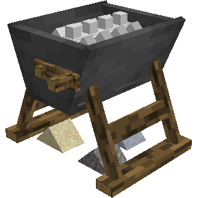
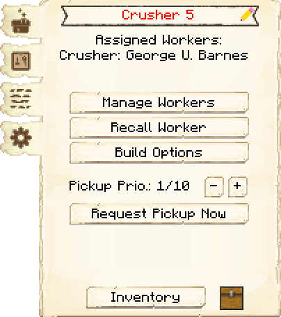
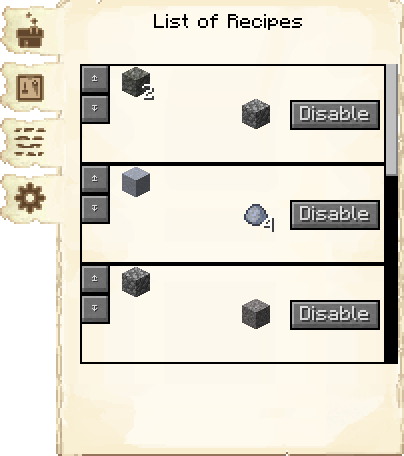
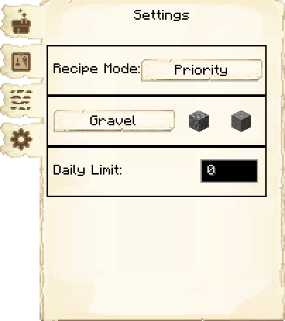
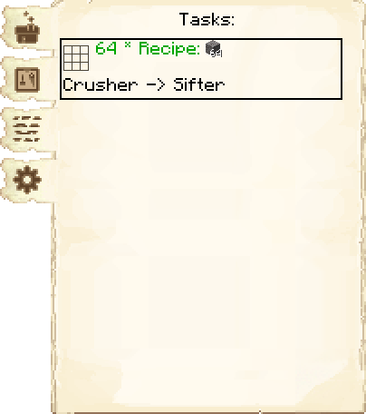

# Crusher's Hut — Britador

<!-- ficha-visual: bloco -->

## Galeria — Medieval Dark Oak

| Frente | Traseira |
|---|---|
| ![[assets/construcoes/medieval-dark-oak/craftsmanship/masonry/crusher/front.jpg]] | ![[assets/construcoes/medieval-dark-oak/craftsmanship/masonry/crusher/back.jpg]] |

## Função

O britador transforma ossos em farinha, pedregulho em cascalho, cascalho em areia e areia em argila, entre outras conversões.

## Capacidade

| Nível | Máximo diário |
|---:|---:|
| 1 | 16 |
| 2 | 64 |
| 3 | 144 |
| 4 | 256 |
| 5 | 999 |

O custo padrão é 2 entradas para 1 saída. A pesquisa **Gilded Hammer** melhora a proporção para 1:1. Um limite diário opcional evita consumir estoques inteiros.

## Correção dos esquemas Medieval

O registro 1259-snapshot ajusta o percurso interno de esquemas Medieval da britador’s Hut: o trilho deixa de depender de uma orientação problemática e os trapdoors foram substituídos por panels para impedir que o trabalhador caia e tenha dificuldade de retornar.

Essa correção vale para construções erguidas ou atualizadas com os esquemas corrigidos. Se uma britador antiga continuar prendendo o trabalhador, compare o interior com a prévia atual antes de alterar blocos manualmente.

## Profissão

[[content/04 - Profissões/Crusher - Britador]]

## Interface do bloco

<!-- galeria-interface -->
### Galeria da interface

| Principal | Receitas de fabricação |
|---|---|
|  |  |

| Configurações | Tarefas |
|---|---|
|  |  |

## Fontes
- [Crusher's Hut — Wiki oficial do MineColonies](https://minecolonies.com/wiki/buildings/crusher/)
- [PR #11737 — correções Medieval da Crusher’s Hut](https://github.com/ldtteam/minecolonies/pull/11737)
