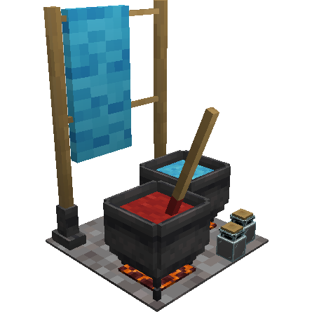
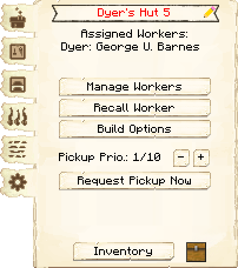
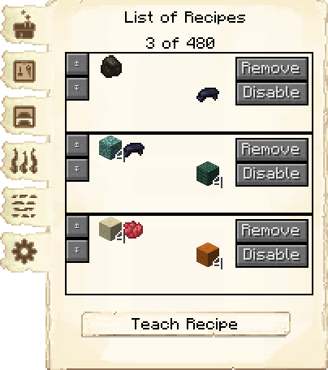
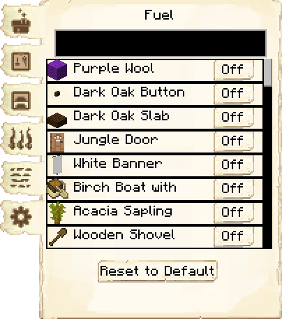
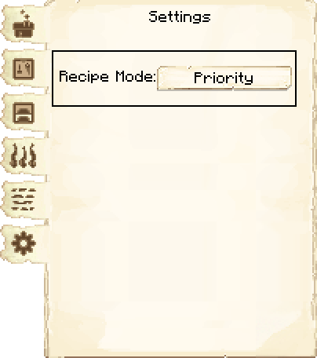
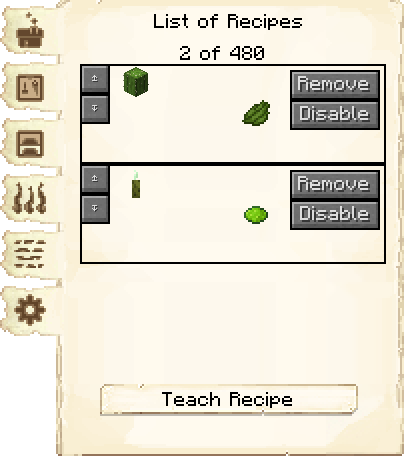
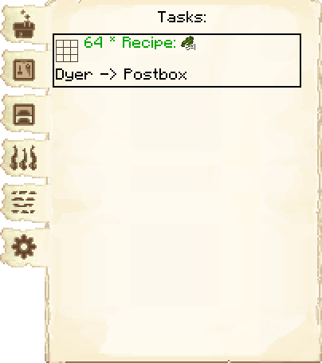

# Dyer's Hut — Oficina do Tingidor

<!-- ficha-visual: bloco -->

## Galeria — Medieval Dark Oak

| Frente | Traseira |
|---|---|
| ![[assets/construcoes/medieval-dark-oak/craftsmanship/luxury/dyer/front.jpg]] | ![[assets/construcoes/medieval-dark-oak/craftsmanship/luxury/dyer/back.jpg]] |

## Função

O tingidor fabrica corantes e itens coloridos por receitas de artesanato ou fundição. Exige **Rainbow Heaven**.

## Operação

Ensine apenas as cores usadas pelos projetos atuais, habilite combustível e mantenha flores ou outras fontes de pigmento no Armazém.

## Habilidades

**Criatividade** (*Creativity*) pode economizar materiais; **Destreza** (*Dexterity*) acelera a produção.

## Profissão

[[content/04 - Profissões/Dyer - Tingidor]]

## Interface do bloco

<!-- galeria-interface -->
### Galeria da interface

| Principal | Receitas de fabricação |
|---|---|
|  |  |

| Combustível | Configurações |
|---|---|
|  |  |

| Receitas de fundição | Tarefas |
|---|---|
|  |  |

## Fontes
- [Dyer's Hut — Wiki oficial do MineColonies](https://minecolonies.com/wiki/buildings/dyer/)
