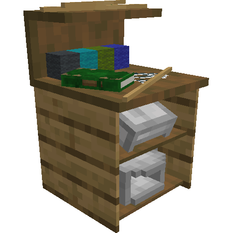
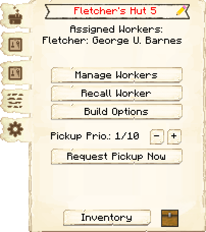
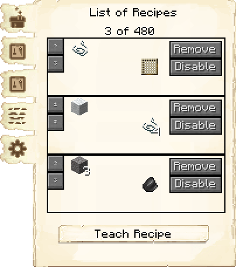
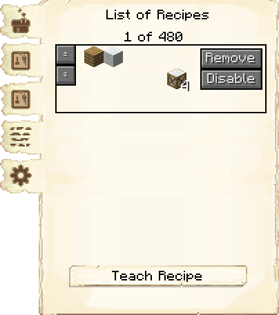
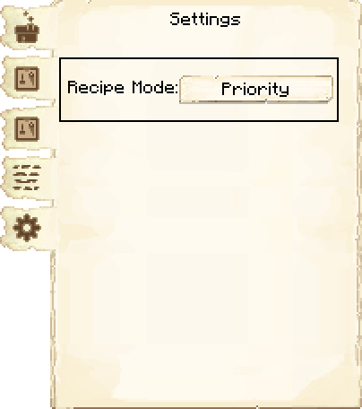
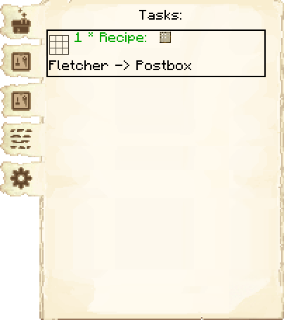

# Fletcher's Hut — Oficina do Flecheiro

<!-- ficha-visual: bloco -->

## Galeria — Medieval Dark Oak

| Frente | Traseira |
|---|---|
| ![[assets/construcoes/medieval-dark-oak/craftsmanship/carpentry/fletcher/front.jpg]] | ![[assets/construcoes/medieval-dark-oak/craftsmanship/carpentry/fletcher/back.jpg]] |

## Função

O Fletcher fabrica arcos, bestas, flechas e receitas ligadas a madeira e linha para atender pedidos da colônia. A construção exige **Stringwork**.

## Operação

Ensine as receitas necessárias, mantenha gravetos, linha, penas e componentes no Armazém e priorize munição usada pelos guardas. A capacidade de receitas cresce com o nível.

## Habilidades

**Destreza** (*Dexterity*) acelera a fabricação; **Criatividade** (*Creativity*) pode reduzir materiais consumidos.

## Profissão

[[content/04 - Profissões/Fletcher - Flecheiro]]

## Interface do bloco

<!-- galeria-interface -->
### Galeria da interface

| Principal | Receitas de fabricação |
|---|---|
|  |  |

| Controle de receitas | Configurações |
|---|---|
|  |  |

| Tarefas |  |
|---|---|
|  |  |

## Fontes
- [Fletcher's Hut — Wiki oficial do MineColonies](https://minecolonies.com/wiki/buildings/fletcher/)
