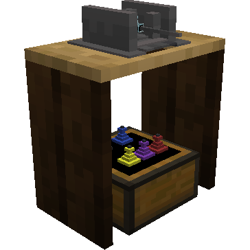
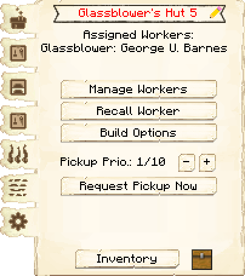
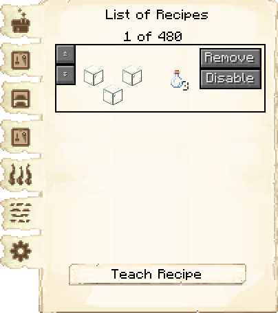
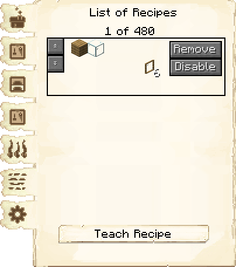
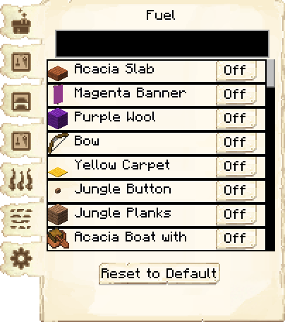
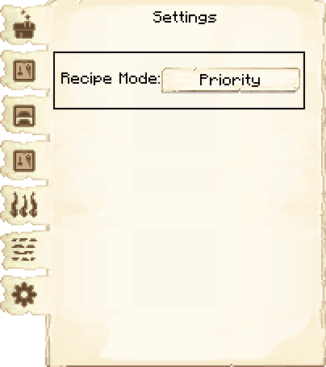
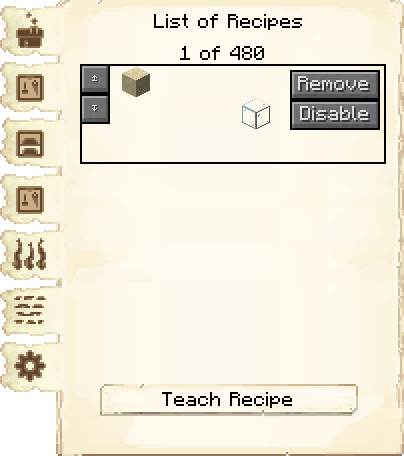
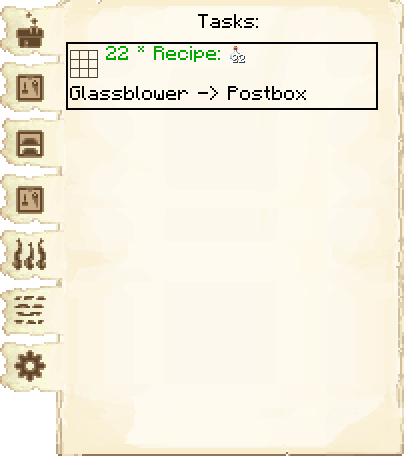

# Glassblower's Hut — Vidraçaria

<!-- ficha-visual: bloco -->

## Galeria — Medieval Dark Oak

| Frente | Traseira |
|---|---|
| ![[assets/construcoes/medieval-dark-oak/craftsmanship/luxury/glassblower/front.jpg]] | ![[assets/construcoes/medieval-dark-oak/craftsmanship/luxury/glassblower/back.jpg]] |

## Função

O vidreiro funde areia em vidro e fabrica painéis. Exige **Those Lungs!**.

## Evolução

Aprende 10, 20, 40, 80 e 160 receitas nos níveis 1 a 5. O número de fornos disponíveis também cresce de um a cinco, limitado pela habilidade do trabalhador.

## Habilidades

**Criatividade** (*Creativity*) influencia o uso dos fornos e a economia; **Concentração** (*Focus*) acelera a fabricação.

## Cadeia

britador ou coleta de areia → Armazém → Vidraçaria → vidro → construtor.

## Profissão

[[content/04 - Profissões/Glassblower - Vidreiro]]

## Interface do bloco

<!-- galeria-interface -->
### Galeria da interface

| Principal | Receitas de fabricação |
|---|---|
|  |  |

| Controle de receitas | Combustível |
|---|---|
|  |  |

| Configurações | Receitas de fundição |
|---|---|
|  |  |

| Tarefas |  |
|---|---|
|  |  |

## Fontes
- [Glassblower's Hut — Wiki oficial do MineColonies](https://minecolonies.com/wiki/buildings/glassblower/)
