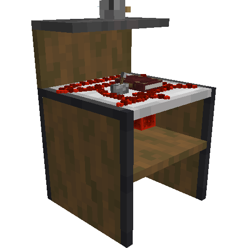
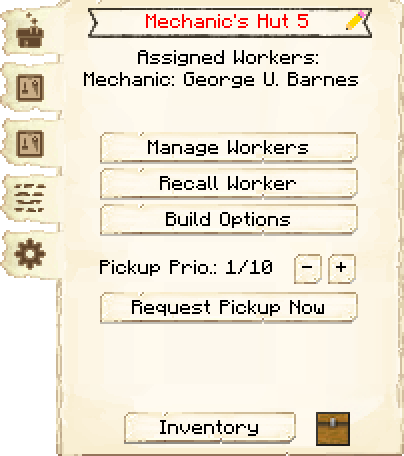
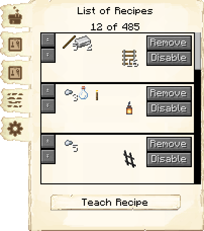
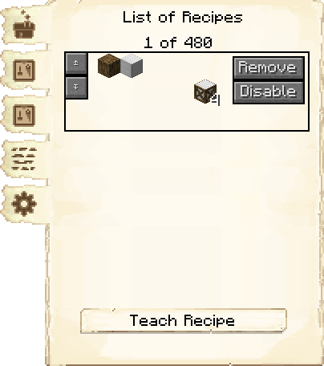
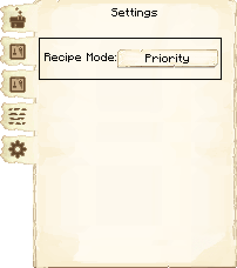
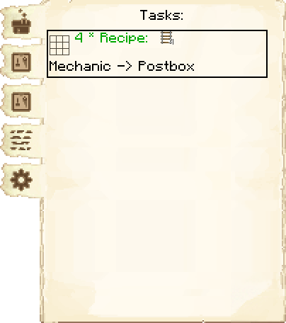

# Mechanic's Hut — Oficina do Mecânico

<!-- ficha-visual: bloco -->

## Galeria — Medieval Dark Oak

| Frente | Traseira |
|---|---|
| ![[assets/construcoes/medieval-dark-oak/craftsmanship/metallurgy/mechanic/front.jpg]] | ![[assets/construcoes/medieval-dark-oak/craftsmanship/metallurgy/mechanic/back.jpg]] |

## Função

O mecânico cobre receitas que não pertencem a outros artesãos: redstone, trilhos, carrinhos, bússolas, relógios, lanternas, blocos de armazenamento e vários componentes especiais.

## Desbloqueio

Exige **What ya Need?**, pesquisa que depende de Ferreiro's Huts somando ao menos três níveis.

## Habilidades

**Conhecimento** (*Knowledge*) pode economizar materiais; **Agilidade** (*Agility*) acelera a fabricação.

## Profissão

[[content/04 - Profissões/Mechanic - Mecânico]]

## Interface do bloco

<!-- galeria-interface -->
### Galeria da interface

| Principal | Receitas de fabricação |
|---|---|
|  |  |

| Controle de receitas | Configurações |
|---|---|
|  |  |

| Tarefas |  |
|---|---|
|  |  |

## Fontes
- [Mechanic's Hut — Wiki oficial do MineColonies](https://minecolonies.com/wiki/buildings/mechanic/)
