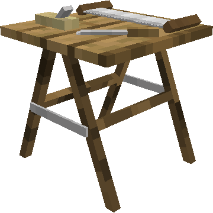
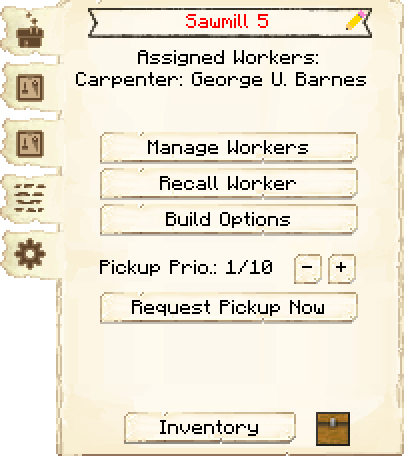
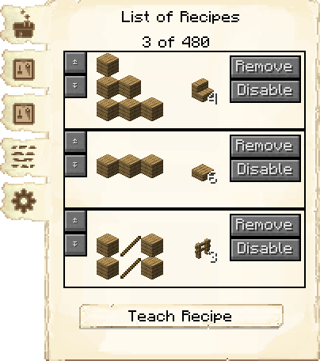
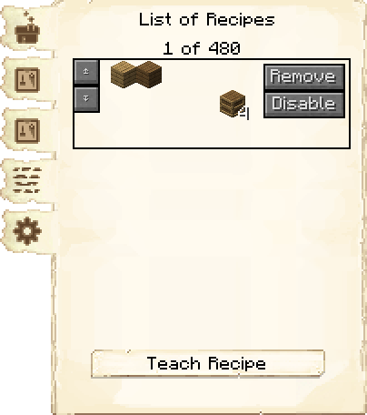
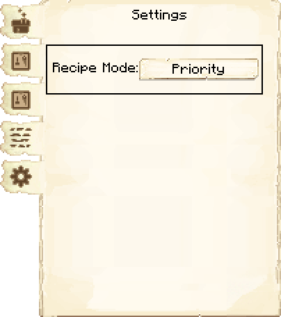
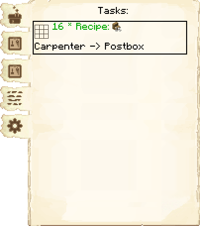

# Sawmill — Serraria

<!-- ficha-visual: bloco -->

## Galeria — Medieval Dark Oak

| Frente | Traseira |
|---|---|
| ![[assets/construcoes/medieval-dark-oak/craftsmanship/carpentry/sawmill/front.jpg]] | ![[assets/construcoes/medieval-dark-oak/craftsmanship/carpentry/sawmill/back.jpg]] |

> [!INFO] Variante disponível
> O acervo também contém `craftsmanship/carpentry/altsawmill`.

## Função

O Carpenter fabrica itens compostos por pelo menos 75% de madeira, sem lingotes, pedra, redstone ou linha. Também produz estantes e blocos compatíveis do Domum Ornamentum. Requer a pesquisa **Woodwork**.

## Evolução

| Nível | Receitas |
|---:|---:|
| 1 | 10 |
| 2 | 20 |
| 3 | 40 |
| 4 | 80 |
| 5 | 160 |

Ensine primeiro tábuas, escadas, cercas, portas e componentes pedidos com frequência. O Carpenter só produz quando recebe uma solicitação.

## Habilidades

**Conhecimento** (*Knowledge*) pode economizar materiais; **Destreza** (*Dexterity*) acelera o artesanato.

## Cadeia

[[content/03 - Construções/Recursos/Forester's Hut - Cabana do Lenhador|Forester's Hut]] → Armazém → Serraria → construtor e outras oficinas.

## Profissão

[[content/04 - Profissões/Carpenter - Carpinteiro]]

## Interface do bloco

<!-- galeria-interface -->
### Galeria da interface

| Principal | Receitas de fabricação |
|---|---|
|  |  |

| Controle de receitas | Configurações |
|---|---|
|  |  |

| Tarefas |  |
|---|---|
|  |  |

## Fontes
- [Sawmill — Wiki oficial do MineColonies](https://minecolonies.com/wiki/buildings/sawmill/)
