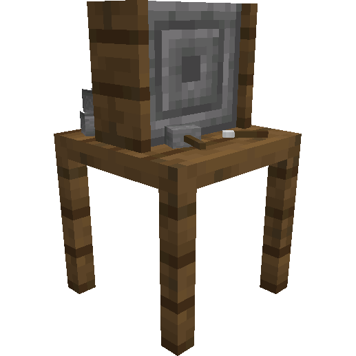
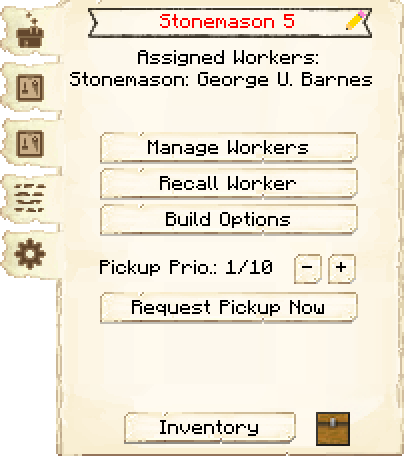
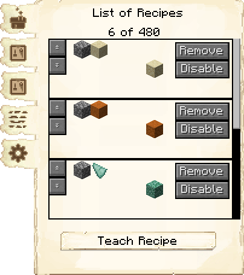
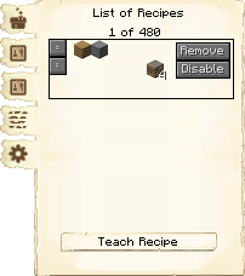
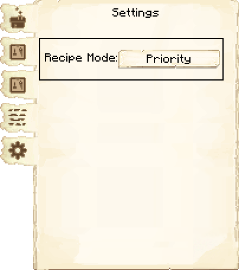
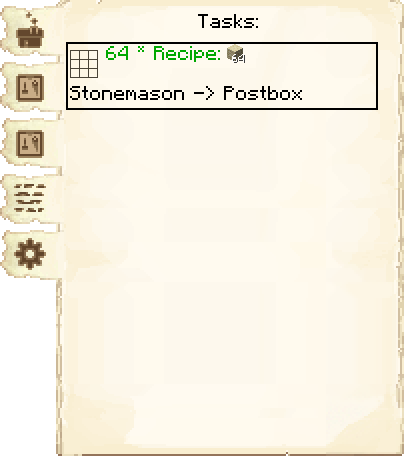

# Stonemason's Hut — Oficina do Pedreiro

<!-- ficha-visual: bloco -->

## Galeria — Medieval Dark Oak

| Frente | Traseira |
|---|---|
| ![[assets/construcoes/medieval-dark-oak/craftsmanship/masonry/stonemason/front.jpg]] | ![[assets/construcoes/medieval-dark-oak/craftsmanship/masonry/stonemason/back.jpg]] |

## Função

O pedreiro fabrica receitas 3 × 3 formadas por pedras e minérios compatíveis, sem lingotes nem componentes de redstone. Exige **Stone Cake**.

## Habilidades

**Criatividade** (*Creativity*) pode economizar materiais; **Destreza** (*Dexterity*) acelera a fabricação.

## Configuração

Ensine blocos, lajes, escadas e componentes realmente usados pelos construtores. A oficina conecta a Mina diretamente à construção civil.

## Profissão

[[content/04 - Profissões/Stonemason - Pedreiro]]

## Interface do bloco

<!-- galeria-interface -->
### Galeria da interface

| Principal | Receitas de fabricação |
|---|---|
|  |  |

| Controle de receitas | Configurações |
|---|---|
|  |  |

| Tarefas |  |
|---|---|
|  |  |

## Fontes
- [Stonemason's Hut — Wiki oficial do MineColonies](https://minecolonies.com/wiki/buildings/stonemason/)
