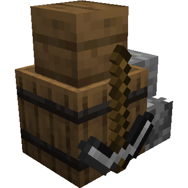
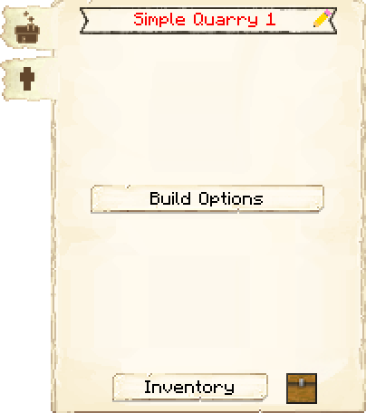
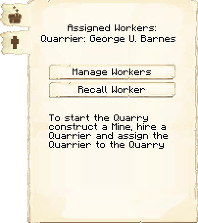

# Quarry — Pedreira

<!-- ficha-visual: bloco -->

## Visão geral

A Pedreira escava uma área delimitada para obter grandes volumes dos blocos que realmente existem no terreno. O modelo simples ocupa **uma região de 16 × 16 blocos** e o médio, **uma área de 2 × 2 dessas regiões**. Diferentemente da [[content/03 - Construções/Recursos/Mine - Mina|Mine]], ela não gera oportunidades adicionais de minério: entrega somente os blocos removidos durante a escavação.

> [!IMPORTANT] Contratação incomum
> O [[content/04 - Profissões/Quarrier - Pedreiro de pedreira|Quarrier]] precisa ser contratado primeiro em uma Mina e, em seguida, atribuído à Pedreira. Enquanto a Mina emprega o pedreiro de pedreira, ela não pode manter um mineiro no mesmo posto.

## Interface do bloco

<!-- galeria-interface -->
### Galeria da interface

| Principal | Trabalhadores |
|---|---|
|  |  |

## Trabalhador responsável

A Pedreira emprega um pedreiro de pedreira. **Força** (*Strength*) acelera a quebra de blocos e **Vigor** (*Stamina*), a colocação dos blocos exigidos pelo projeto.

## Progressão

A Pedreira não segue a progressão convencional de cinco níveis. Sua escala é definida pela variante escolhida na ferramenta de construção (*Build Tool*):

| Variante | Área de escavação | Uso indicado |
|---|---:|---|
| Simple | 1 × 1 chunk | Produção concentrada e menor impacto territorial |
| Medium | 2 × 2 chunks | Extração em grande volume e projeto de longa duração |

## Operação

1. construa uma [[content/03 - Construções/Recursos/Mine - Mina|Mine]];
2. contrate nela um pedreiro de pedreira;
3. construa e atribua o trabalhador à Pedreira;
4. forneça picaretas e os materiais solicitados;
5. mantenha a retirada de blocos conectada ao Armazém.

O pedreiro de pedreira executa um projeto físico de escavação. Interferir no volume reservado pode interromper etapas ou deixar o esquema inconsistente.

## Configurações recomendadas

- mantenha a contratação manual durante a transferência do pedreiro de pedreira;
- ajuste a prioridade de coleta conforme o volume acumulado;
- confira o inventário do bloco da construção e os estantes antes de diagnosticar falta de produção;
- use **Chamar trabalhador** (*Recall Worker*) apenas quando o cidadão estiver preso ou fora da área de trabalho.

## Dicas de posicionamento

> [!NOTE] Análise do Vault
> Trate a Pedreira como uma obra territorial, não como uma cabana compacta. Visualize todo o esquema, reserve a área completa e coloque-a longe do centro urbano. Uma rota curta para entregadores reduz o risco de a produção parar por inventário cheio.

- evite residências, estradas essenciais e outras construções dentro do volume de escavação;
- verifique rios, cavernas e limites da colônia antes de confirmar o projeto;
- deixe acesso seguro na borda, sem depender de atravessar a própria cava;
- proteja o trajeto entre a Pedreira e a malha logística.

## Pedreira ou Mina?

| Objetivo | Melhor ponto de partida |
|---|---|
| Minérios e produção subterrânea contínua | [[content/03 - Construções/Recursos/Mine - Mina|Mine]] |
| Grande volume de pedra e blocos presentes no terreno | Pedreira |
| Menor ocupação permanente da superfície | Mina |
| Projeto de escavação ampla e previsível | Pedreira |

## Construções relacionadas

- [[content/03 - Construções/Recursos/Mine - Mina]]
- [[content/03 - Construções/Transporte/Warehouse - Armazém]]
- [[content/03 - Construções/Transporte/Courier's Hut - Cabana do Entregador]]
- [[content/03 - Construções/Produção/Stonemason's Hut - Oficina do Pedreiro]]
- [[content/03 - Construções/Produção/Crusher's Hut - Britador]]

## Fontes

- [Quarry — Wiki oficial do MineColonies](https://minecolonies.com/wiki/buildings/quarry/)
- [Mine — Wiki oficial do MineColonies](https://minecolonies.com/wiki/buildings/miner/)

