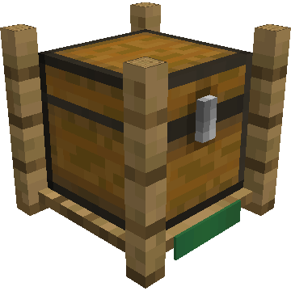
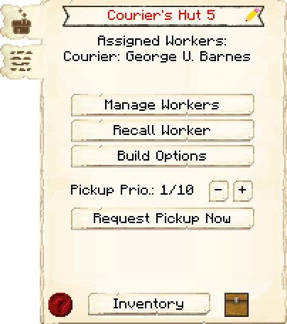
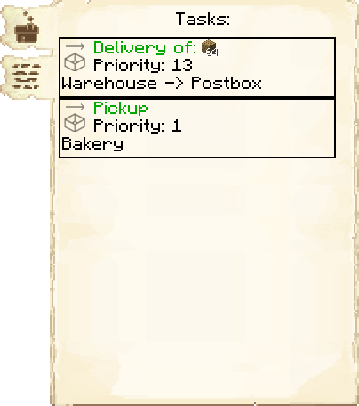

# Courier's Hut — Cabana do Entregador

<!-- ficha-visual: bloco -->

## Galeria — Medieval Dark Oak

| Vista frontal | Vista traseira |
|---|---|
| ![[assets/construcoes/medieval-dark-oak/craftsmanship/storage/deliveryman/front.jpg]] | ![[assets/construcoes/medieval-dark-oak/craftsmanship/storage/deliveryman/back.jpg]] |

> [!INFO] Variante disponível
> O acervo também contém `craftsmanship/storage/altdeliveryman`.

## Visão geral

O entregador transporta recursos entre Armazém e cabanas de trabalho. Cada entregador precisa de sua própria cabana.

## Interface do bloco

<!-- galeria-interface -->
### Galeria da interface

| Principal | Tarefas |
|---|---|
|  |  |

## Requisito

O Armazém precisa estar construído pelo menos no nível 1 para o entregador trabalhar.

## Efeito dos níveis

Melhorar a Cabana do Entregador aumenta a quantidade de itens que o entregador consegue transportar. O limite total de entregadores vinculados depende do nível do Armazém: dois por nível, até dez.

## Habilidades importantes

- **Agility:** aumenta a velocidade de deslocamento.
- **Adaptability:** permite visitar mais cabanas antes de retornar ao Armazém.

## Interface logística

- **Prioridade de coleta** (*Pickup Priority*): define a prioridade de coleta desta cabana.
- **Solicitar coleta agora** (*Request Pickup Now*): chama um entregador disponível para recolher itens.
- **Opções de construção** (*Build Options*): cria ordens de construção, melhoria e reparo.
- **Chamar trabalhador** (*Recall Worker*): chama o entregador de volta.

## Dicas de posicionamento

- Coloque perto do Armazém.
- Dê acesso imediato à malha principal de caminhos.
- Evite escadas, portas e curvas desnecessárias.
- Melhore a cabana quando o entregador fizer muitas viagens pequenas.

## Diagnóstico

| Sintoma | Verifique |
|---|---|
| entregador parado | Armazém construído e trabalhador atribuído |
| Não encontra item | Item no Armazém correto |
| Muitas viagens | Nível da cabana e estoque fragmentado |
| Entregas lentas | Caminhos, Agilidade (*Agility*) e distância |
| Ignora uma cabana | Prioridade de coleta e pedidos |

## Construções relacionadas

- [[content/03 - Construções/Transporte/Warehouse - Armazém]]
- [[content/03 - Construções/Produção/Builder's Hut - Cabana do Construtor]]

## Fontes

- [Courier's Hut — Wiki oficial do MineColonies](https://minecolonies.com/wiki/buildings/deliveryman/)
- [Warehouse — Wiki oficial do MineColonies](https://minecolonies.com/wiki/buildings/warehouse/)
- [Requests — Wiki oficial do MineColonies](https://minecolonies.com/wiki/systems/request/)
