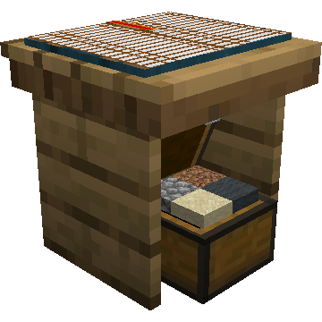
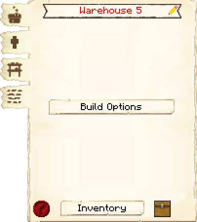
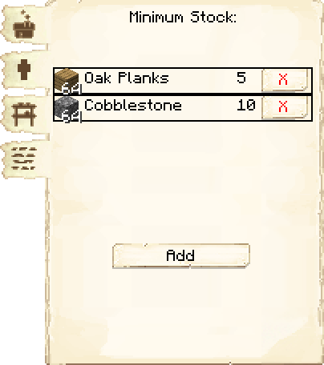
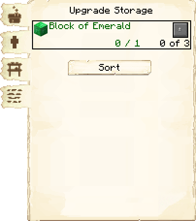
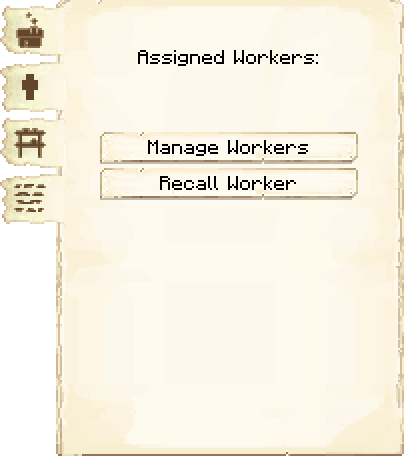

# Warehouse — Armazém

<!-- ficha-visual: bloco -->

## Galeria — Medieval Dark Oak

| Vista frontal | Vista traseira |
|---|---|
| ![[assets/construcoes/medieval-dark-oak/craftsmanship/storage/warehouse/front.jpg]] | ![[assets/construcoes/medieval-dark-oak/craftsmanship/storage/warehouse/back.jpg]] |

> [!INFO] Variante disponível
> O acervo também contém `craftsmanship/storage/altwarehouse`.

## Visão geral

O Armazém é o armazenamento central da rede logística. entregadores depositam nele produtos e retiram itens necessários pelos trabalhadores.

## Capacidade de entregadores

| Nível | entregadores máximos |
|---:|---:|
| 1 | 2 |
| 2 | 4 |
| 3 | 6 |
| 4 | 8 |
| 5 | 10 |

Cada entregador ainda precisa de sua própria Cabana do Entregador.

## Benefícios dos níveis

- aumentam a quantidade de entregadores que podem usar o Armazém;
- ampliam a capacidade física de armazenamento do esquema;
- no nível 3, disponibilizam a ação de organizar/empilhar os estantes;
- no nível 5, permitem ampliar três vezes a capacidade de pilhas por Rack usando blocos de esmeralda.

## Interface

<!-- galeria-interface -->
### Galeria da interface

| Principal | Estoque mínimo |
|---|---|
|  |  |

| Armazenamento | Trabalhadores |
|---|---|
|  |  |

### Workers

Exibe e administra os entregadores ligados ao Armazém.

### Estoque mínimo (*Minimum Stock*)

Mantém quantidades mínimas de itens estratégicos.

### Storage

Administra melhorias de armazenamento e, a partir do nível adequado, ordenação dos itens.

## Dicas de posicionamento

- Posicione no encontro das rotas de produção.
- Garanta caminhos largos e diretos para os entregadores.
- Evite colocar no extremo da área protegida.
- Reserve espaço para várias entregador's Huts próximas.
- Não transforme a entrada em praça decorativa congestionada.

## Problemas frequentes

### Itens não chegam aos trabalhadores

Verifique Armazém construído, entregador ativo, pedidos, caminhos e vinculação ao Armazém correto.

### O armazenamento parece cheio

Procure estantes em todos os andares, compacte itens e melhore o edifício.

## Construções relacionadas

- [[content/03 - Construções/Transporte/Courier's Hut - Cabana do Entregador]]
- [[content/03 - Construções/Produção/Builder's Hut - Cabana do Construtor]]

## Fontes

- [Warehouse — Wiki oficial do MineColonies](https://minecolonies.com/wiki/buildings/warehouse/)
- [Requests — Wiki oficial do MineColonies](https://minecolonies.com/wiki/systems/request/)
