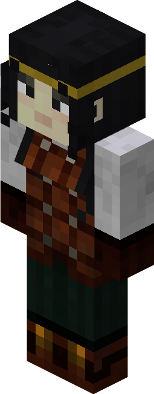

# Archer — Arqueiro

<!-- ficha-visual: worker -->

## Visão geral

O arqueiro é um guarda de longo alcance. Funciona melhor com linha de visão, munição e proteção contra inimigos que chegam ao corpo a corpo.

## Habilidades

- **Agility:** aumenta o dano.
- **Adaptability:** aumenta o alcance.

## Preparação

Treine na [[content/03 - Construções/Militar/Archery - Campo de Arquearia]], mantenha arcos e flechas em estoque e use torres com campo de visão aberto. Também pode ocupar uma das duas posições fixas da [[content/03 - Construções/Militar/Gatehouse - Portaria|Portaria]].

## Fontes

- [Barracks Tower e Archer — Wiki oficial](https://minecolonies.com/wiki/buildings/barrackstower/)
- [Archery — Wiki oficial](https://minecolonies.com/wiki/buildings/archery/)
