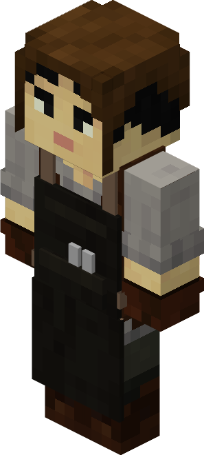
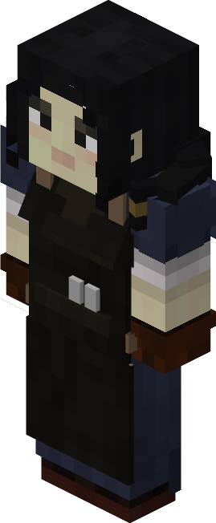

# Blacksmith — Ferreiro

<!-- ficha-visual: worker -->

Trabalha na [[content/03 - Construções/Produção/Blacksmith's Hut - Ferraria]], criando ferramentas, armas, escudos e armaduras. **Força** (*Strength*) acelera o artesanato; **Concentração** (*Focus*) pode economizar materiais.

## Fontes

- [Blacksmith's Hut e Blacksmith — Wiki oficial](https://minecolonies.com/wiki/buildings/blacksmith/)
