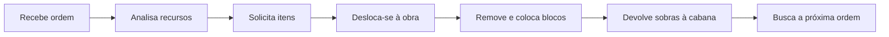

# Builder — Construtor

## Visão geral

O Builder executa ordens de construção, melhoria, reparo e reposicionamento. Ele remove blocos necessários, busca materiais na cabana e coloca o esquema bloco por bloco.

## Local de trabalho

[[content/03 - Construções/Produção/Builder's Hut - Cabana do Construtor]]

## Ciclo de trabalho

## Responsabilidades do jogador

- criar e priorizar ordens;
- fornecer ferramentas e materiais;
- manter o caminho até a obra acessível;
- melhorar a Builder's Hut antes de obras de nível superior;
- verificar a aba **Required Resources**.

## Limitações

- trabalha em uma ordem por vez;
- não supera o nível da própria Builder's Hut;
- depende de ferramentas adequadas, comida e acesso;
- viagens longas reduzem a produtividade.

## Como escolher o primeiro Builder

Se a contratação estiver automática, o jogo atribui um cidadão. No modo manual, compare as habilidades indicadas pela interface da cabana e escolha o melhor candidato disponível. Evite atrasar a fundação buscando um cidadão perfeito: localização e abastecimento costumam ter impacto imediato maior.

## Problemas frequentes

### Fica parado na cabana

Abra **Required Resources**, verifique ferramentas, fome e a ordem ativa.

### Vai e volta sem construir

Pode estar buscando itens, trocando ferramenta ou enfrentando um caminho ruim.

### Não aceita obra de nível superior

Melhore primeiro a Builder's Hut desse trabalhador.

## Fontes

- [Builder's Hut e Builder — Wiki oficial do MineColonies](https://minecolonies.com/wiki/buildings/builder/)
- [Build Tool — Wiki oficial do MineColonies](https://minecolonies.com/wiki/items/sceptergold/)
