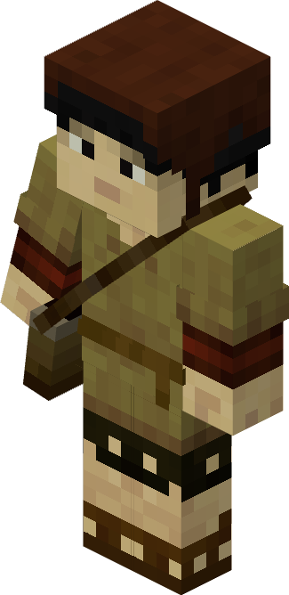
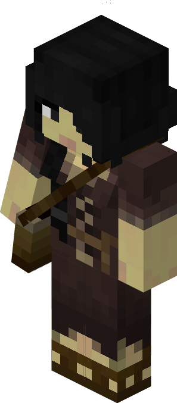

# Chicken Farmer — Criador de Galinhas

<!-- ficha-visual: worker -->

Trabalha na [[content/03 - Construções/Criação de Animais/Chicken Farmer's Hut - Galinheiro]], alimentando, reproduzindo e abatendo galinhas, além de coletar ovos e penas.

O jogador fornece os primeiros animais e mantém sementes disponíveis. Desative reprodução quando o estoque de produtos já estiver suficiente.

## Fontes

- [Chicken Farmer’s Hut — Wiki oficial](https://minecolonies.com/wiki/buildings/chickenherder/)
