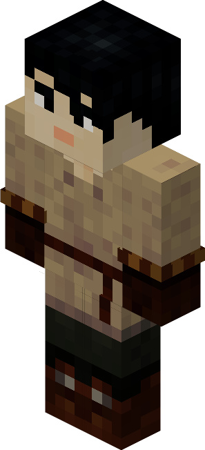
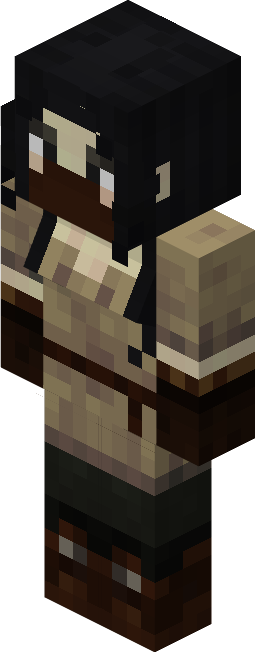

# Concrete Mixer — Misturador de Concreto

<!-- ficha-visual: worker -->

Trabalha na [[content/03 - Construções/Produção/Concrete Mixer's Hut - Oficina de Concreto]], transformando areia, cascalho e corantes em concreto. **Vigor** (*Stamina*) acelera a coleta; **Destreza** (*Dexterity*), a fabricação.

## Fontes

- [Concrete Mixer's Hut e trabalhador — Wiki oficial](https://minecolonies.com/wiki/buildings/concretemixer/)
