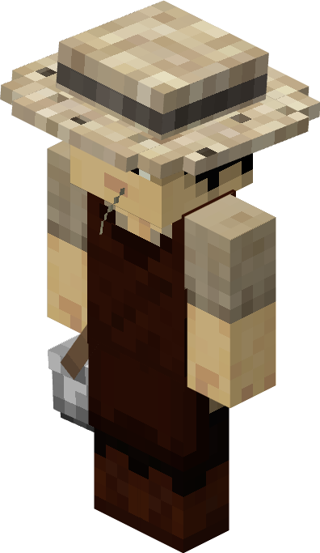
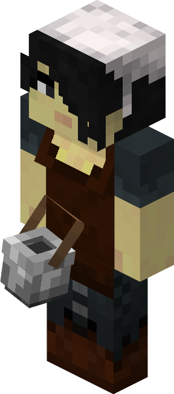

# Cowhand — Vaqueiro

<!-- ficha-visual: worker -->

Trabalha na [[content/03 - Construções/Criação de Animais/Cowhand's Hut - Curral]], criando vacas para carne, couro e leite.

O jogador fornece os animais iniciais e trigo. Ajuste reprodução, alimentação e ordenha para evitar consumo ou produção excessivos.

## Fontes

- [Cowhand’s Hut e Cowhand — Wiki oficial](https://minecolonies.com/wiki/buildings/cowboy/)
