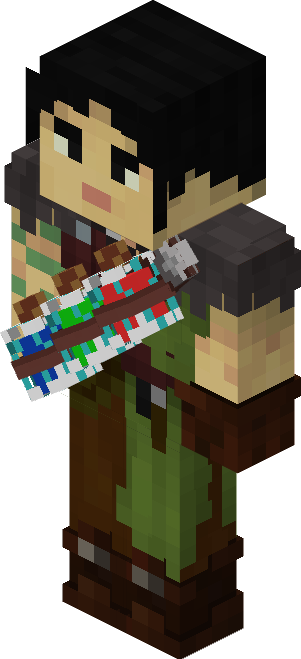
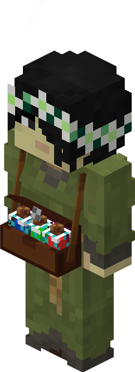

# Druid — Druida

<!-- ficha-visual: worker -->

## Visão geral

O Druida é um guarda de suporte que utiliza efeitos arremessáveis. Atua melhor acompanhado por cavaleiros e arqueiros.

## Habilidades

- **Mana:** aumenta a duração dos efeitos.
- **Focus:** melhora a precisão dos arremessos.

## Uso tático

Não use Druids isolados na linha de frente. Posicione-os em grupo, com estoque adequado e uma rota protegida para recuar.

## Fontes

- [Barracks Tower e Druid — Wiki oficial](https://minecolonies.com/wiki/buildings/barrackstower/)
