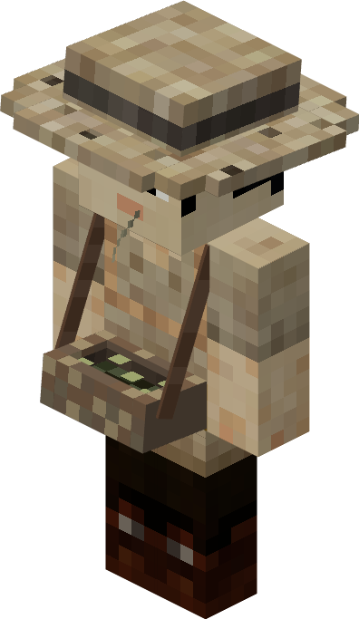

# Farmer — Fazendeiro

<!-- ficha-visual: worker -->

## Visão geral

O Farmer prepara, planta e colhe os campos vinculados à cabana. É a base da alimentação renovável e o produtor das culturas especiais usadas em refeições de maior qualidade.

## Local de trabalho

[[content/03 - Construções/Alimentação/Farmer's Hut - Cabana do Fazendeiro]]

## Necessidades

- enxada para trabalhar o solo;
- machado para algumas culturas;
- sementes selecionadas no campo;
- campos livres e acessíveis;
- ciclo de dia e noite habilitado.

## Ritmo de trabalho

Cada campo recebe uma ação por dia. Por isso, a primeira colheita demora e vários campos aumentam a variedade mais depressa do que aceleram um único cultivo.

## Boa estratégia

Comece com um ingrediente básico, depois dedique campos às receitas ensinadas ao Chef. Guarde sementes no Armazém e expanda a cabana conforme a demanda do Salão de Refeições.

## Fontes

- [Farmer's Hut e Farmer — Wiki oficial do MineColonies](https://minecolonies.com/wiki/buildings/farmer/)
