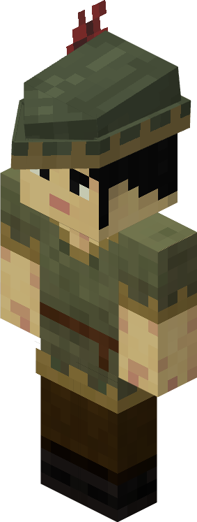

# Fletcher — Flecheiro

<!-- ficha-visual: worker -->

Trabalha na [[content/03 - Construções/Produção/Fletcher's Hut - Oficina do Flecheiro]], produzindo arcos, bestas e munição. **Destreza** (*Dexterity*) aumenta a velocidade e **Criatividade** (*Creativity*) pode economizar materiais.

## Fontes

- [Fletcher's Hut e Fletcher — Wiki oficial](https://minecolonies.com/wiki/buildings/fletcher/)
