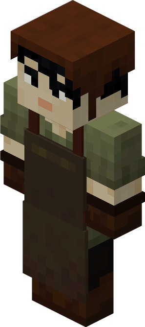

# Planter — Cultivador

<!-- ficha-visual: worker -->

O Planter trabalha na [[content/03 - Construções/Agricultura/Plantation - Plantação]], cuidando de campos especializados e fabricando derivados.

## Habilidades

- **Agility:** pode economizar materiais.
- **Dexterity:** acelera a fabricação.

## Operação

Associe campos compatíveis, respeite o limite de culturas simultâneas e ensine apenas receitas úteis. O Planter precisa de acesso aos esquemas dos campos e às entradas armazenadas.

## Fontes

- [Plantation e Planter — Wiki oficial](https://minecolonies.com/wiki/buildings/plantation/)
