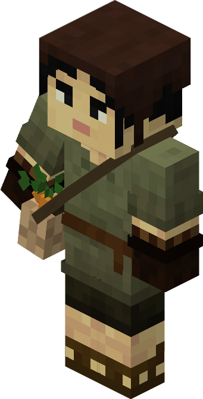
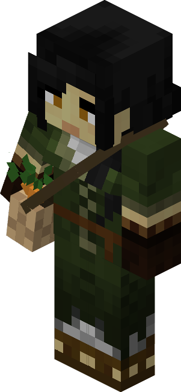

# Rabbit Herder — Criador de Coelhos

<!-- ficha-visual: worker -->

Trabalha na [[content/03 - Construções/Criação de Animais/Rabbit Hutch - Coelheira]], criando coelhos para carne e outros produtos.

**Agilidade** (*Agility*) melhora a chance de acertar o animal; **Atletismo** (*Athletics*) acelera o crescimento. O jogador deve levar os dois primeiros coelhos.

## Fontes

- [Rabbit Hutch e Rabbit Herder — Wiki oficial](https://minecolonies.com/wiki/buildings/rabbithutch/)
