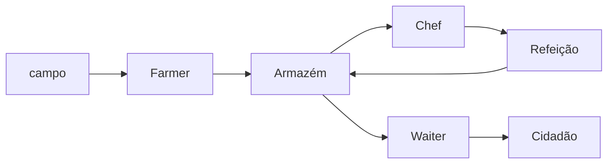
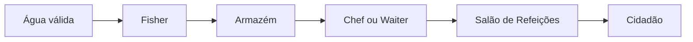
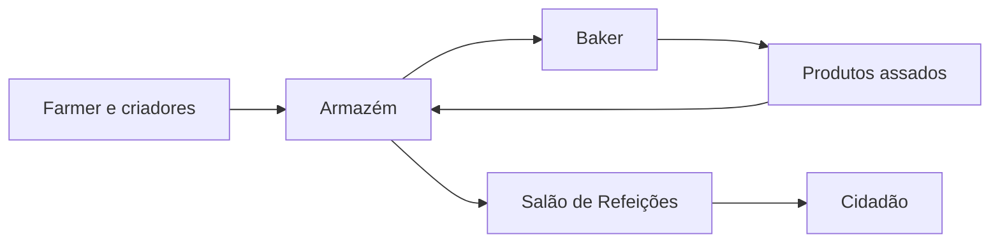

# Cadeias alimentares

> [!NOTE] Análise do Vault
> As cadeias abaixo são uma organização editorial baseada nas dependências e no sistema de pedidos do mod. Elas representam fluxos recomendados para uma colônia estável, não uma ordem oficial obrigatória.

## Cadeia agrícola

## Cadeia da pesca

## Cadeia da Bakery

Garrafas usadas em receitas do Baker ainda podem quebrar. O registro 1259-snapshot reduziu essa perda, mas o estoque deve continuar prevendo reposição.

## Como estabilizar

- produza antes de diversificar;
- mantenha estoques mínimos dos ingredientes críticos;
- ensine apenas receitas sustentáveis;
- use entregadores suficientes;
- aproxime produtores, Armazém, cozinha e salão;
- preserve um alimento de emergência.
- dimensione a produção pelo consumo diário estimado no Salão de Refeições;
- revalide receitas e rendimentos após atualizar para 1259-snapshot.

## Leitura relacionada

- [[content/05 - Alimentação/Sistema de fome]]
- [[content/05 - Alimentação/Cardápio recomendado]]
- [[content/06 - Recursos e Produção/Armazém e entregadores]]

## Fontes

- [PR #11683 — Food Adjustments #1](https://github.com/ldtteam/minecolonies/pull/11683)
- [PR #11714 — Bottle safety](https://github.com/ldtteam/minecolonies/pull/11714)
