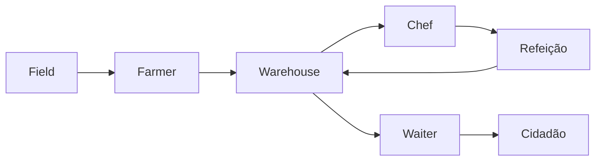
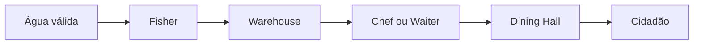

# Cadeias alimentares

> [!NOTE] Análise do Vault
> As cadeias abaixo são uma organização editorial baseada nas dependências e no sistema de pedidos do mod. Elas representam fluxos recomendados para uma colônia estável, não uma ordem oficial obrigatória.

## Cadeia agrícola

## Cadeia da pesca

## Como estabilizar

- produza antes de diversificar;
- mantenha estoques mínimos dos ingredientes críticos;
- ensine apenas receitas sustentáveis;
- use Couriers suficientes;
- aproxime produtores, Warehouse, cozinha e salão;
- preserve um alimento de emergência.

## Leitura relacionada

- [[content/05 - Alimentação/Sistema de fome]]
- [[content/05 - Alimentação/Cardápio recomendado]]
- [[content/06 - Recursos e Produção/Armazém e entregadores]]
