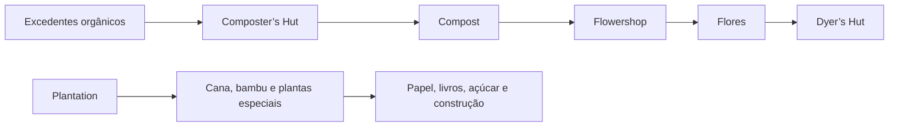

# Agricultura avançada

## Objetivo

O Lote 6 expande a agricultura além dos alimentos básicos: reaproveita excedentes, produz flores e automatiza plantas que não pertencem aos Fields comuns.

## Ordem recomendada

1. Construa a Composter’s Hut e autorize apenas excedentes.
2. Crie uma reserva de Compost.
3. Libere a Flowershop se houver demanda de flores e corantes.
4. Pesquise Let It Grow.
5. Construa a Plantation e um campo especializado.
6. Expanda culturas somente quando Couriers e Warehouse suportarem o volume.

## Destinos principais

| Recurso | Destino |
|---|---|
| Compost | Flowershop e agricultura |
| Flores | Dyer’s Hut e decoração |
| Cana | Papel, livros e açúcar |
| Bambu | Construção e receitas ensinadas |
| Cacto | Corantes e projetos |
| Kelp e plantas aquáticas | Produção especializada |

## Fontes

- [Composter’s Hut — Wiki oficial](https://minecolonies.com/wiki/buildings/composter/)
- [Flowershop — Wiki oficial](https://minecolonies.com/wiki/buildings/florist/)
- [Plantation — Wiki oficial](https://minecolonies.com/wiki/buildings/plantation/)
