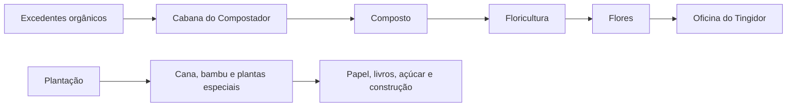

# Agricultura avançada

## Objetivo

O Lote 6 expande a agricultura além dos alimentos básicos: reaproveita excedentes, produz flores e automatiza plantas que não pertencem aos Fields comuns.

## Ordem recomendada

1. Construa a [[content/03 - Construções/Agricultura/Composter's Hut - Cabana do Compostador|Cabana do Compostador]] e autorize apenas excedentes.
2. Crie uma reserva de composto.
3. Libere a [[content/03 - Construções/Agricultura/Flowershop - Floricultura|Floricultura]] se houver demanda de flores e corantes.
4. Pesquise **Deixe crescer** (*Let It Grow*).
5. Construa a [[content/03 - Construções/Agricultura/Plantation - Plantação|Plantação]] e um campo especializado.
6. Expanda as culturas somente quando os entregadores e o armazém suportarem o volume.

## Destinos principais

| Recurso | Destino |
|---|---|
| Composto | Floricultura e agricultura |
| Flores | Oficina do Tingidor e decoração |
| Cana | Papel, livros e açúcar |
| Bambu | Construção e receitas ensinadas |
| Cacto | Corantes e projetos |
| Kelp e plantas aquáticas | Produção especializada |

## Fontes

- [Composter’s Hut — Wiki oficial](https://minecolonies.com/wiki/buildings/composter/)
- [Flowershop — Wiki oficial](https://minecolonies.com/wiki/buildings/florist/)
- [Plantation — Wiki oficial](https://minecolonies.com/wiki/buildings/plantation/)
