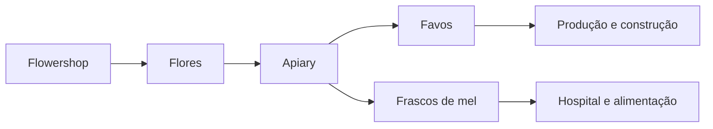

# Apicultura e produção de mel

## Configuração

1. Posicione colmeias ao redor do Apiary.
2. Associe-as com a ferramenta própria.
3. Habilite flores disponíveis.
4. Escolha favos, mel ou ambos.
5. Ative reprodução somente com flores e espaço.
6. Aumente o número de colmeias conforme o nível.

## Fontes

- [Apiary — Wiki oficial](https://minecolonies.com/wiki/buildings/beekeeper/)
