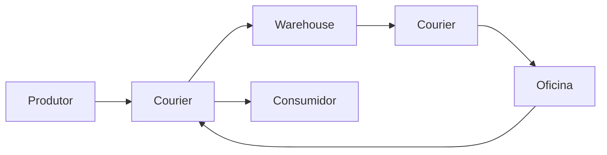

# Armazém e entregadores

## Papel na produção

O Warehouse centraliza materiais e os Couriers conectam produtores, artesãos e consumidores. Sem essa dupla, pedidos ficam presos mesmo quando os itens existem em alguma cabana.

## Fluxo

## Prioridades

- mantenha estradas curtas e desobstruídas;
- melhore Warehouse e Courier's Huts conforme o número de oficinas;
- use prioridade de coleta para cabanas que acumulam saídas;
- use **Request Pickup Now** apenas como correção pontual;
- evite estoques mínimos excessivos;
- distribua oficinas em torno do eixo logístico.

## Diagnóstico

Quando um pedido não avança, abra sua cadeia completa: confira a entrada no Warehouse, o Courier disponível, a receita ensinada, o combustível habilitado e o espaço no destino.

## Construções principais

- [[content/03 - Construções/Transporte/Warehouse - Armazém]]
- [[content/03 - Construções/Transporte/Courier's Hut - Cabana do Entregador]]

## Fontes

- [Warehouse — Wiki oficial](https://minecolonies.com/wiki/buildings/warehouse/)
- [Courier's Hut — Wiki oficial](https://minecolonies.com/wiki/buildings/deliveryman/)
- [Request System — Wiki oficial](https://minecolonies.com/wiki/systems/request/)
