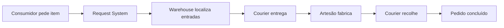

# Automação da colônia

## O princípio

No MineColonies, automação significa conectar pedidos, receitas, estoque e Couriers. Uma oficina não produz livremente: ela responde a solicitações ou a estoques mínimos configurados.

## Configuração em seis passos

1. Ensine a receita à oficina correta.
2. Garanta produtores para todas as entradas.
3. Habilite combustíveis quando a oficina usa fornos.
4. Defina estoque mínimo somente para itens recorrentes.
5. Ajuste prioridade de coleta e entrega.
6. Observe pedidos pendentes antes de ampliar a cadeia.

## Divisão das oficinas

| Grupo | Oficinas |
|---|---|
| Madeira | Sawmill e Fletcher's Hut |
| Pedra | Crusher's Hut, Stonemason's Hut e Brick Yard |
| Metal | Smeltery, Blacksmith's Hut e Mechanic's Hut |
| Especialidades | Bakery, Dyer's Hut, Glassblower's Hut, Concrete Mixer's Hut e Alchemist Laboratory |

## Gargalos frequentes

- receita ensinada na oficina errada;
- combustível desabilitado;
- entrada reservada por outra cadeia;
- Courier sobrecarregado;
- limite diário baixo;
- pesquisa ainda bloqueada;
- produto final sem consumidor.

## Fontes

- [Request System — Wiki oficial](https://minecolonies.com/wiki/systems/request/)
