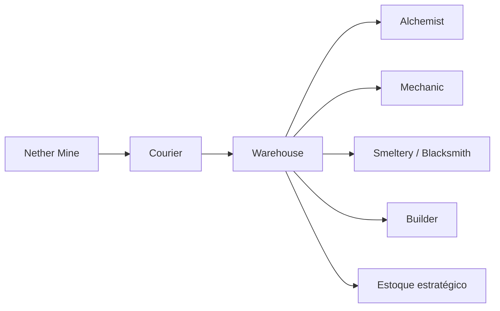

---
tipo: guia
status: publicado
ultima_revisao: 2026-07-16
tags: [minecolonies, nether, produção, logística, lote-8b]
---

# Cadeia de recursos do Nether

## Destinos principais

| Recurso ou família | Uso estratégico |
|---|---|
| Blaze Rod, Magma Cream e Ghast Tear | Alquimia e componentes especiais |
| Nether Wart e cogumelos | Poções e alimentação |
| Quartz, Glowstone e Redstone relacionada | Mechanic, iluminação e construção |
| Netherrack, Basalt e Blackstone | Construção e transformação |
| Crimson e Warped Stem | Madeira alternativa e receitas relacionadas |
| Ouro e Nether Gold Ore | Metalurgia e componentes |
| Ancient Debris | Progressão avançada do jogador |

## Fluxo recomendado

## Política de estoque

- retire os resultados da Nether Mine com prioridade suficiente para não ocupar seus racks;
- preserve Ancient Debris, Ghast Tears e Blaze Rods como materiais estratégicos;
- distribua Nether Wart e ingredientes de poção conforme receitas realmente ensinadas;
- mantenha blocos decorativos em estoque moderado;
- use pedidos manuais quando um projeto avançado exigir grande volume.

> [!NOTE] Análise do Vault
> A Nether Mine é uma fonte diversificada e parcialmente aleatória. Ela complementa a exploração do jogador, mas não substitui uma coleta direcionada quando a colônia precisa de grande quantidade de um material específico.

## Fontes

- [Nether Mine — Wiki oficial do MineColonies](https://minecolonies.com/wiki/buildings/netherworker/)
