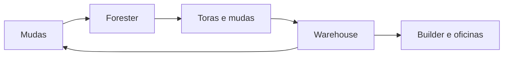
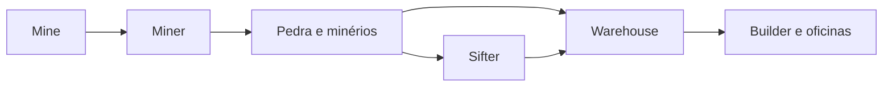

# Cadeias de produção

## Madeira

Pontos de controle: replantio ativo, espécies autorizadas, zona de corte, machados, mudas em reserva e retirada por Courier.

## Mineração

Pontos de controle: nível da Mine, ferramentas, profundidade configurada, iluminação e espaço no Warehouse. O Sifter é um complemento posterior, desbloqueado por pesquisa.

## Alimentação

A cadeia completa está em [[content/05 - Alimentação/Cadeias alimentares]].

## Regra de diagnóstico

Analise a cadeia na ordem:

1. **Entrada:** matéria-prima existe?
2. **Trabalhador:** está presente, alimentado e equipado?
3. **Construção:** nível e receita são suficientes?
4. **Transporte:** há Courier e caminho livre?
5. **Armazenamento:** há espaço e estoque mínimo?
6. **Destino:** o consumidor aceita o item?

## Fontes

- [Forester's Hut — Wiki oficial do MineColonies](https://minecolonies.com/wiki/buildings/lumberjack/)
- [Mine — Wiki oficial do MineColonies](https://minecolonies.com/wiki/buildings/miner/)
- [Sifter's Hut — Wiki oficial do MineColonies](https://minecolonies.com/wiki/buildings/sifter/)
