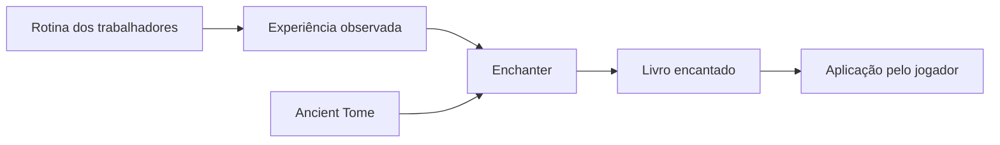

# Encantamentos e Ancient Tomes

## Cadeia básica

O Enchanter não retira experiência dos cidadãos e não encanta equipamentos diretamente. Cada produção de livro depende da experiência reunida, de Ancient Tome e da progressão da torre.

## Qualidade da produção

- **Nível da torre:** libera resultados de níveis progressivamente maiores.
- **Knowledge:** melhora o nível dos livros produzidos.
- **Mana:** acelera a obtenção de experiência ao aumentar o rendimento por viagem.

## Raider’s Bane

O MineColonies adiciona o encantamento **Raider’s Bane**, aplicável a espadas e machados para aumentar o dano contra invasores do mod.

- Torre nível 3 ou superior: pode obter Raider’s Bane.
- Torre nível 5: necessária para Raider’s Bane II.

## Estratégia de estoque

> [!NOTE] Análise do Vault
> Ancient Tomes são uma entrada limitada e estratégica. Reserve-os no Warehouse e acompanhe os livros obtidos antes de ampliar a produção. A melhor prioridade depende dos equipamentos e das ameaças enfrentadas pela colônia.

## Fontes

- [Enchanter’s Tower — Wiki oficial do MineColonies](https://minecolonies.com/wiki/buildings/enchanter/)
- [Enchantments — Wiki oficial do MineColonies](https://minecolonies.com/wiki/misc/enchantments/)
