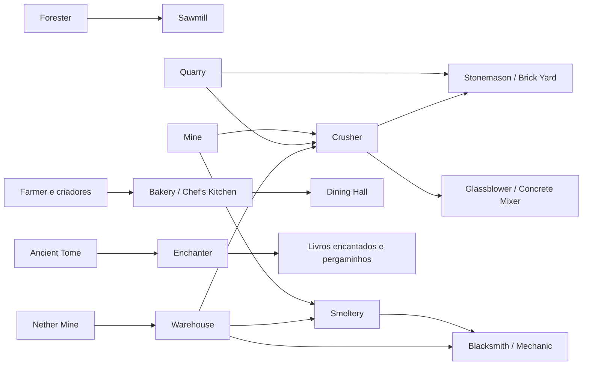

---
tipo: referencia
status: publicado
ultima_revisao: 2026-07-16
tags: [minecolonies, receitas, oficinas, produção, fix]
---

# Matriz de receitas e oficinas

> [!NOTE] Como usar
> Procure o produto desejado, confirme a oficina responsável e verifique a pesquisa. A lista resume famílias de receitas; compatibilidade com outros mods e alterações de modpacks podem mudar resultados individuais.

## Madeira e equipamento de tiro

| Produto ou família | Oficina | Entradas comuns | Pesquisa |
|---|---|---|---|
| Tábuas, escadas, lajes, cercas e portas | [[content/03 - Construções/Produção/Sawmill - Serraria|Sawmill]] | Toras e tábuas | Woodwork |
| Racks e peças de madeira do Domum Ornamentum | [[content/03 - Construções/Produção/Sawmill - Serraria|Sawmill]] | Madeira | Woodwork |
| Arcos, bestas e flechas | [[content/03 - Construções/Produção/Fletcher's Hut - Oficina do Flecheiro|Fletcher's Hut]] | Gravetos, linha, penas e componentes | Stringwork |

## Pedra, argila e vidro

| Produto ou família | Oficina | Entradas comuns | Pesquisa |
|---|---|---|---|
| Cascalho, areia, argila e farinha de osso | [[content/03 - Construções/Produção/Crusher's Hut - Britador|Crusher's Hut]] | Pedra, cascalho, areia e ossos | Sem pesquisa de construção |
| Blocos, lajes e escadas de pedra | [[content/03 - Construções/Produção/Stonemason's Hut - Oficina do Pedreiro|Stonemason's Hut]] | Pedra e variantes | Stone Cake |
| Pedra lisa, tijolos, terracota e carvão vegetal | [[content/03 - Construções/Produção/Brick Yard - Olaria|Brick Yard]] | Pedra, argila, terracota e toras | The Flintstones |
| Vidro e painéis de vidro | [[content/03 - Construções/Produção/Glassblower's Hut - Vidraçaria|Glassblower's Hut]] | Areia e combustível | Those Lungs! |
| Concreto e pó de concreto | [[content/03 - Construções/Produção/Concrete Mixer's Hut - Oficina de Concreto|Concrete Mixer's Hut]] | Areia, cascalho e corante | Pave the Road |

## Extração primária

| Recurso ou família | Origem | Operação | Observação |
|---|---|---|---|
| Pedra e minérios subterrâneos | [[content/03 - Construções/Recursos/Mine - Mina|Mine]] | Miner abre poço e ramificações | Pode obter oportunidades adicionais de minério |
| Grandes volumes de pedra e blocos naturais | [[content/03 - Construções/Recursos/Quarry - Pedreira|Quarry]] | Quarrier escava 1 × 1 ou 2 × 2 chunks | Produz somente os blocos existentes no terreno |

## Metal, ferramentas e mecanismos

| Produto ou família | Oficina | Entradas comuns | Pesquisa |
|---|---|---|---|
| Lingotes | [[content/03 - Construções/Produção/Smeltery - Fundição|Smeltery]] | Minérios e combustível | Hot! |
| Ferramentas, espadas, escudos e armaduras | [[content/03 - Construções/Produção/Blacksmith's Hut - Ferraria|Blacksmith's Hut]] | Lingotes, gravetos e outros componentes | Hitting Iron! |
| Redstone, trilhos, carrinhos e componentes especiais | [[content/03 - Construções/Produção/Mechanic's Hut - Oficina do Mecânico|Mechanic's Hut]] | Redstone, metais e componentes variados | What ya Need? |

## Alimentação, cores e alquimia

| Produto ou família | Oficina | Entradas comuns | Pesquisa |
|---|---|---|---|
| Pães, biscoitos, bolos e tortas | [[content/03 - Construções/Produção/Bakery - Padaria|Bakery]] | Trigo, açúcar, ovos e abóbora | Nenhuma |
| Refeições elaboradas | [[content/03 - Construções/Alimentação/Chef's Kitchen - Cozinha do Chef|Chef's Kitchen]] | Ingredientes agrícolas e animais | Nenhuma |
| Comida simples assada e distribuição | [[content/03 - Construções/Alimentação/Dining Hall - Salão de Refeições|Dining Hall]] | Alimentos crus e combustível | Nenhuma |
| Corantes e itens coloridos | [[content/03 - Construções/Produção/Dyer's Hut - Oficina do Tingidor|Dyer's Hut]] | Flores, pigmentos e itens-base | Rainbow Heaven |
| Poções | [[content/03 - Construções/Produção/Alchemist Laboratory - Laboratório do Alquimista|Alchemist Laboratory]] | Frascos e ingredientes de alquimia | Magic Potions |

## Agricultura avançada

| Produto ou família | Construção | Entradas comuns | Pesquisa |
|---|---|---|---|
| Compost, Dirt e Podzol | [[content/03 - Construções/Agricultura/Composter's Hut - Cabana do Compostador|Composter’s Hut]] | Materiais orgânicos | Biodegradable |
| Flores | [[content/03 - Construções/Agricultura/Flowershop - Floricultura|Flowershop]] | Compost e machado | Flower Power |
| Cana, bambu, cacto e plantas especiais | [[content/03 - Construções/Agricultura/Plantation - Plantação|Plantation]] | Campos especializados | Let It Grow |

## Magia e encantamentos

| Produto ou família | Construção | Entradas comuns | Pesquisa |
|---|---|---|---|
| Livros encantados | [[content/03 - Construções/Especializadas/Enchanter's Tower - Torre do Encantador|Enchanter’s Tower]] | Ancient Tome e experiência observada | Nenhuma |
| Pergaminhos de teletransporte | [[content/03 - Construções/Especializadas/Enchanter's Tower - Torre do Encantador|Enchanter’s Tower]] | Papel, bússola, Build Tool ou pergaminhos-base | Varia conforme a receita |

## Recursos do Nether

| Produto ou família | Construção | Origem | Pesquisa |
|---|---|---|---|
| Ingredientes de alquimia e recursos do Nether | [[content/03 - Construções/Especializadas/Nether Mine - Mina do Nether|Nether Mine]] | Expedições simuladas | Open the Nether |
| Lava Bucket | [[content/03 - Construções/Especializadas/Nether Mine - Mina do Nether|Nether Mine]] | Receita da construção | Open the Nether |

## Transformações de recursos

## Fontes

- [Buildings — Wiki oficial do MineColonies](https://minecolonies.com/wiki/buildings/)
- [Research — Wiki oficial do MineColonies](https://minecolonies.com/wiki/systems/research/)
- [Request System — Wiki oficial do MineColonies](https://minecolonies.com/wiki/systems/request/)
